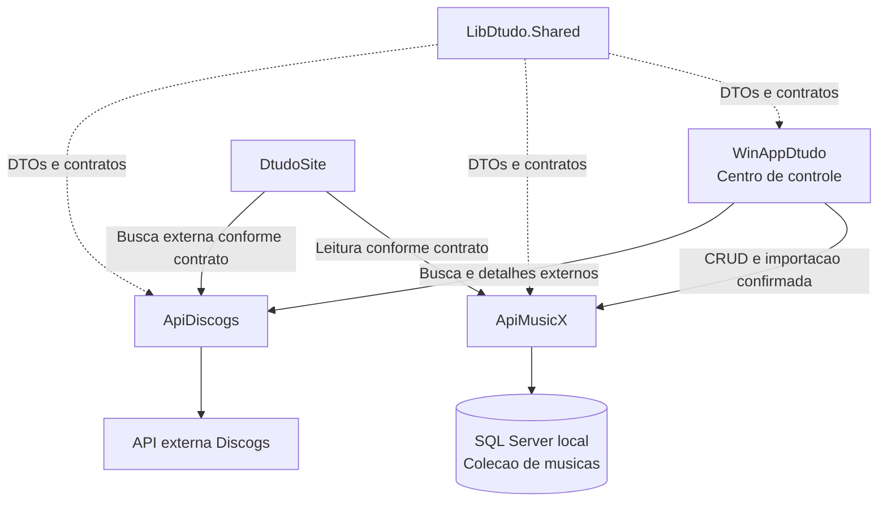

# Plano de Implementacao: Fases 1 e 2

## ApiMusicX e ApiDiscogs

> Documento operacional para execucao incremental por agentes de IA.
> Cada parte possui um prompt que pode ser copiado para um agente separado.

**Status:** planejamento  
**Solucao:** Dtudo2026  
**Fase 1:** ApiMusicX  
**Fase 2:** ApiDiscogs  
**Autoridade operacional:** WinAppDtudo  
**Fase posterior:** servico de analise e criacao de estruturas de pastas e arquivos de musica

---

## 1. Decisoes de dominio

### 1.1 Colecao, nao catalogo

Neste projeto, o termo correto e **Colecao**.

Uma Colecao representa a discografia organizada de um artista, banda ou grupo. Ela pode conter albuns, singles, EPs, compilacoes, videos, faixas e referencias a arquivos locais.

O termo `catalogo` nao deve ser usado para nomear a regra de negocio, entidades, textos de interface ou endpoints novos. Quando for necessario diferenciar a origem dos dados, usar termos como:

- Colecao local;
- discografia do artista;
- dados externos da Discogs;
- resultado de busca externa;
- release externo;
- referencia de arquivo local.

### 1.2 WinAppDtudo e a base central

O `WinAppDtudo` e o centro de controle da solucao. Ele deve:

- iniciar e monitorar os servicos locais quando necessario;
- autenticar o usuario;
- comandar consultas externas;
- comandar importacoes e gravacoes;
- controlar o fluxo de confirmacao antes de alterar a Colecao;
- exibir mensagens detalhadas de progresso e falha;
- coordenar a futura analise de pastas e arquivos;
- nunca gravar diretamente no SQL Server das APIs;
- nunca acessar diretamente a API externa Discogs.

As APIs fornecem fronteiras tecnicas e regras de persistencia ou integracao. Elas nao substituem o papel de orquestrador do `WinAppDtudo`.

### 1.3 Responsabilidade das APIs

| Componente | Responsabilidade | Nao deve fazer |
|---|---|---|
| `ApiMusicX` | Persistir e consultar a Colecao local de musicas, artistas, bandas, releases e faixas | Consultar a Discogs ou manipular diretamente o disco local |
| `ApiDiscogs` | Encapsular a API externa Discogs, normalizar resultados, aplicar cache e resiliencia | Gravar a Colecao local ou expor o token da Discogs |
| `WinAppDtudo` | Orquestrar consultas, confirmacoes, importacoes e operacoes locais | Acessar diretamente o banco ou a API externa |
| `DtudoSite` | Exibir dados conforme os contratos das APIs e, quando permitido, realizar consultas de leitura | Acessar diretamente a Discogs ou depender do `ApiNode` |
| `LibDtudo.Shared` | Compartilhar DTOs, contratos e utilitarios realmente comuns | Tornar-se deposito de regras especificas de uma API |
| `ApiNode` | Fonte temporaria de referencia e migracao | Permanecer como dependencia de runtime |

### 1.4 Fase 3 fora deste plano

As duas primeiras fases nao devem criar, mover, renomear, apagar ou reorganizar pastas e arquivos de musica.

A Fase 3 sera responsavel por um servico dentro do `WinAppDtudo` para analisar estruturas, propor alteracoes e criar pastas e arquivos. As Fases 1 e 2 podem apenas armazenar ou transportar referencias relativas a arquivos existentes, sem executar operacoes fisicas no disco.

---

## 2. Arquitetura alvo



### 2.1 Regra de fluxo de importacao

O fluxo principal deve ser:

1. O usuario inicia uma busca no `WinAppDtudo`.
2. O `WinAppDtudo` chama a `ApiDiscogs`.
3. A `ApiDiscogs` consulta a Discogs, aplica as politicas de resiliencia e devolve DTOs normalizados.
4. O `WinAppDtudo` mostra os resultados e aguarda a selecao ou confirmacao do usuario.
5. O `WinAppDtudo` converte o resultado selecionado para o contrato da `ApiMusicX`.
6. A `ApiMusicX` valida, aplica idempotencia e grava a Colecao no SQL Server.
7. O `WinAppDtudo` mostra o resultado de cada etapa.
8. O `DtudoSite` consulta a `ApiMusicX` para exibir dados locais persistidos.

A `ApiDiscogs` nao deve chamar a `ApiMusicX` para salvar dados. A orquestracao permanece no `WinAppDtudo`.

### 2.2 Padroes existentes a reutilizar

Os agentes devem estudar e reaproveitar os padroes ja usados em:

- `ApiMyAnimes`: ASP.NET Core, Entity Framework Core, SQL Server, migrations, autorizacao, CORS, health check, Swagger/OpenAPI, Serilog e comentarios XML.
- `ApiMyAnimeList`: cliente HTTP externo, DTOs normalizados, allowlist de host e caminho, cache, resiliencia, tratamento de timeout, circuit breaker e respostas HTTP consistentes.
- `WinAppDtudo`: servicos de startup, health checks, configuracao por `appsettings.json` e variaveis de ambiente, autenticacao PKCE, dark mode e feedback detalhado de operacoes.
- `LibDtudo.Shared`: somente os contratos que realmente precisarem ser compartilhados entre projetos.

Nenhum agente deve substituir esses padroes por uma arquitetura nova sem justificar a mudanca no relatorio de entrega.

---

## 3. Prompts copiaveis para os agentes

Esta secao possui dois tipos de bloco:

- blocos identificados como `PROMPT COPIAVEL`: devem ser copiados e enviados a um agente;
- blocos de configuracao, contrato ou exemplo: servem apenas para consulta e nao sao prompts.

Cada prompt copiavel comeca na linha `===== INICIO DO PROMPT ... =====` e termina na linha `===== FIM DO PROMPT ... =====`. Copie somente o conteudo entre esses dois marcadores, incluindo o `Use o Prompt Base.` quando ele aparecer.

### PROMPT COPIAVEL BASE

```text
===== INICIO DO PROMPT BASE =====
Voce esta trabalhando na solucao C:\2026MeusProjetos\Dtudo2026, chamada Dtudo2026.

Leia primeiro AGENTS.md, .github/copilot-instructions.md e os arquivos diretamente relacionados ao objetivo desta tarefa. Nao leia toda a solucao. Use a estrutura existente como fonte de verdade.

A arquitetura definida e:
- WinAppDtudo e o centro de controle da solucao.
- ApiMusicX e a API ASP.NET Core dona da persistencia da Colecao local de musicas.
- ApiDiscogs e a API ASP.NET Core que encapsula exclusivamente a API externa Discogs.
- DtudoSite nao acessa diretamente a Discogs e nao deve depender do ApiNode em runtime.
- ApiNode e apenas referencia temporaria para migracao.
- A analise e criacao fisica de pastas e arquivos pertence a uma Fase 3 e nao faz parte desta tarefa.

Regras obrigatorias:
1. Target framework dos novos projetos: .NET 10, seguindo os projetos atuais.
2. Reaproveite configuracao, autenticacao, autorizacao, logging, health checks, CORS, Swagger/OpenAPI e clientes HTTP ja existentes.
3. Nao grave diretamente no banco a partir do WinAppDtudo e nao permita que a ApiDiscogs grave a Colecao.
4. Nunca versionar tokens, senhas, certificados privados ou dados sensiveis.
5. Nunca acessar diretamente a API externa Discogs a partir do WinAppDtudo ou DtudoSite.
6. Preserve os comentarios XML dos controllers e escreva documentacao equivalente nos endpoints novos.
7. Mantenha o WinAppDtudo em Dark Mode e reutilize ThemeManager, DarkModeColors e padroes visuais existentes.
8. Nao criar operacoes fisicas de pastas ou arquivos de musica nesta tarefa.
9. Nao alterar arquivos ou projetos sem relacao direta com o objetivo.
10. Antes de editar, formule uma hipotese local sobre a implementacao e um teste que possa confirma-la ou invalida-la.
11. Depois da primeira edicao, execute a validacao mais estreita disponivel antes de ampliar o escopo.
12. Nao faca commit.

Ao terminar, informe:
- resumo do que foi feito;
- arquivos criados ou alterados;
- endpoints, DTOs ou configuracoes adicionados;
- comandos de validacao executados e resultado;
- decisoes ou pendencias para a proxima parte;
- qualquer risco residual.
===== FIM DO PROMPT BASE =====
```

---

## 4. Ordem de execucao e dependencias

Executar as partes nesta ordem. Uma parte so deve ser considerada concluida quando seus criterios de aceite forem atendidos.

```text
PARTE 0
  -> PARTE 1.1 -> PARTE 1.2 -> PARTE 1.3 -> PARTE 1.4
  -> PARTE 1.5 -> PARTE 1.6 -> PARTE 1.7 -> PARTE 1.8
  -> PARTE 2.1 -> PARTE 2.2 -> PARTE 2.3 -> PARTE 2.4
  -> PARTE 2.5 -> PARTE 2.6 -> PARTE 2.7
```

Dependencias importantes:

- O modelo da Fase 1 deve estar aprovado antes dos controllers.
- Os contratos da `ApiMusicX` devem existir antes da integracao do `WinAppDtudo`.
- A `ApiMusicX` deve estar funcional antes da importacao Discogs.
- A `ApiDiscogs` deve devolver DTOs normalizados antes de qualquer tela de selecao ou importacao.
- A remocao do proxy Node so pode ocorrer depois dos testes de substituicao no `DtudoSite`.

---

# FASE 1 - ApiMusicX

## Objetivo da Fase 1

Criar a `ApiMusicX`, API ASP.NET Core responsavel pelo armazenamento local da Colecao de discografias, com banco SQL Server, Entity Framework Core, contratos estaveis, autenticacao, autorizacao, health check, Swagger/OpenAPI, testes e integracao comandada pelo `WinAppDtudo`.

Ao final desta fase, o sistema deve conseguir armazenar e consultar os dados locais sem depender do `ApiNode`, da Discogs ou da internet.

---

## PARTE 1.1 - Descoberta, modelo de dominio e contrato da ApiMusicX

### Objetivo

Definir o modelo minimo e os contratos da `ApiMusicX` antes de criar banco ou endpoints.

### Decisoes que o agente deve produzir

- Como representar artista solo, banda e grupo sem duplicar o modelo.
- Como representar uma Colecao pertencente a um artista.
- Como representar album, single, EP, compilacao e video.
- Como representar faixas e sua ordem.
- Como armazenar IDs externos da Discogs sem tornar a Discogs dona do modelo.
- Como guardar referencias de arquivos locais sem executar operacoes de disco.
- Como garantir idempotencia de imports repetidos.
- Como preservar uma chave legada do JSON sem usa-la como regra de negocio principal.

### Modelo inicial recomendado

Os nomes finais devem seguir as convencoes do repositorio, mas o agente deve avaliar estas entidades:

- `MusicArtist`: artista, banda ou grupo, com nome de exibicao, tipo, aliases e identificadores externos.
- `MusicCollection`: Colecao de discografia pertencente a um ou mais artistas, conforme a necessidade do dominio.
- `MusicRelease`: album, single, EP, compilacao ou video, com titulo, ano, tipo e IDs externos.
- `MusicTrack`: faixa, posicao, titulo, duracao quando disponivel e artistas participantes quando necessario.
- `MusicLocalFileReference`: referencia relativa a arquivo existente, sem criar, mover ou excluir arquivo.
- `ExternalSourceIdentifier`: provedor e identificador externo, com unicidade por provedor e tipo de recurso.

O agente deve evitar criar tabelas ou propriedades apenas para copiar todos os detalhes brutos da Discogs. O modelo local deve representar as necessidades da Colecao.

### PROMPT COPIAVEL 1.1

```text
===== INICIO DO PROMPT 1.1 =====
Use o Prompt Base.

Execute a PARTE 1.1 da Fase 1.

Inspecione os modelos, DTOs, DbContext, controllers e migrations de ApiMyAnimes, alem dos contratos compartilhados que possam ser reutilizados. Inspecione tambem o JSON legado ApiNode/mymusicx/mymusicx.json apenas para entender o formato de origem; nao o transforme em dependencia de runtime.

Defina uma proposta concreta para o dominio da ApiMusicX. A proposta deve representar Colecao de discografias, artistas/bandas, releases, faixas, IDs externos e referencias locais sem executar operacoes no sistema de arquivos.

Crie ou atualize apenas um documento de decisao de dominio se isso for necessario. Nao crie ainda migrations, controllers ou integracao com WinAppDtudo.

Inclua no relatorio:
- diagrama ou lista de relacionamentos;
- chaves primarias e unicas;
- campos obrigatorios e opcionais;
- regras de idempotencia;
- mapeamento inicial do JSON legado;
- pontos que precisam ser confirmados antes da PARTE 1.2.

Valide que o modelo nao chama a Colecao de catalogo e que ApiMusicX nao depende da Discogs para operar.
===== FIM DO PROMPT 1.1 =====
```

### Criterios de aceite

- Existe uma decisao documentada sobre as entidades e relacionamentos.
- Artista, Colecao, release e faixa nao estao misturados em um unico objeto sem limites claros.
- IDs da Discogs sao referencias externas, nao chaves de dominio obrigatorias.
- Referencias de arquivos nao causam acesso fisico ao disco.
- O modelo permite reimportacao sem duplicacao previsivel.

---

## PARTE 1.2 - Criacao e configuracao base da ApiMusicX

### Objetivo

Criar o projeto ASP.NET Core da `ApiMusicX` seguindo o padrao de .NET 10 dos projetos existentes.

### Escopo

- projeto e referencia na solucao;
- `Program.cs` e configuracao de servicos;
- configuracao de ambiente e user-secrets;
- autenticacao JWT e autorizacao;
- CORS restrito aos origins configurados;
- Serilog e correlacao de requisicoes;
- health check;
- Swagger/OpenAPI;
- convencoes de pasta: `Configuration`, `Controllers`, `Data`, `Dtos`, `Infrastructure`, `Mappers`, `Services` e `Migrations` quando aplicavel;
- launch profile e porta local documentada.

### Autorizacao inicial

O agente deve reutilizar o modelo de identidade da solucao. A matriz deve ser definida antes de liberar endpoints:

| Operacao | Permissao inicial sugerida |
|---|---|
| Ler Colecao | `catalog.read` ou permissao equivalente ja provisionada |
| Criar e importar | `catalog.write` |
| Alterar | `catalog.write` |
| Excluir | `catalog.delete` |
| Health | `health.read` |

Se for necessario criar permissoes especificas de musica, documentar a alteracao coordenada em `ApiIdentity`, `WinAppDtudo` e demais consumidores. Nao criar nomes divergentes em cada projeto.

### PROMPT COPIAVEL 1.2

```text
===== INICIO DO PROMPT 1.2 =====
Use o Prompt Base.

Execute a PARTE 1.2 da Fase 1.

Crie o projeto ApiMusicX em .NET 10 seguindo a estrutura e os padroes de ApiMyAnimes. Adicione-o a solucao correta sem ler ou modificar projetos nao relacionados.

Configure:
- autenticacao JWT usando ApiIdentity e as opcoes compartilhadas existentes;
- autorizacao com a matriz de permissoes aprovada;
- CORS por configuracao, sem AllowAnyOrigin em ambiente de producao;
- Serilog, correlacao e redacao de dados sensiveis;
- health check sem expor segredos ou connection strings;
- Swagger/OpenAPI com autenticacao e comentarios XML;
- appsettings de desenvolvimento sem segredos versionados;
- user-secrets para a connection string quando aplicavel;
- endpoint de health com nome e URL documentados.

Reaproveite LibDtudo.Shared quando existir uma abstracao adequada. Nao copie implementacoes inteiras de ApiMyAnimes sem verificar nomes e responsabilidades. Nao crie ainda toda a persistencia de dominio se a PARTE 1.1 ainda estiver pendente.

Execute build e o teste mais estreito possivel. Informe a URL local e qualquer ajuste que precise ser feito no ApiIdentity ou no WinAppDtudo.
===== FIM DO PROMPT 1.2 =====
```

### Criterios de aceite

- `dotnet build ApiMusicX/ApiMusicX.csproj` passa.
- O projeto inicia com configuracao valida e health check funcional.
- O Swagger documenta a API sem segredos.
- A API nao inicia com connection string critica ausente quando ela deve ser obrigatoria.
- Nenhum token ou senha foi adicionado a arquivos versionados.

---

## PARTE 1.3 - Banco local, entidades, EF Core e migrations

### Objetivo

Implementar o armazenamento SQL Server da Colecao.

### Regras de persistencia

- Usar EF Core e SQL Server conforme `ApiMyAnimes`.
- Criar um DbContext proprio da `ApiMusicX`.
- Definir indices e constraints para evitar duplicidade.
- Usar `AsNoTracking` em leituras que nao editam entidades.
- Usar transacao em importacoes que alteram varias entidades.
- Validar limites de tamanho, anos, IDs e strings vazias.
- Armazenar caminhos de arquivos como referencias relativas e normalizadas, sem resolver para um caminho arbitrario.
- Nao armazenar o token da Discogs no banco local.
- Nao permitir que dados vindos da Discogs substituam silenciosamente uma alteracao local confirmada.

### Idempotencia minima

A importacao deve conseguir identificar pelo menos:

- artista por provedor + tipo de recurso + ID externo, quando houver;
- release por provedor + tipo de recurso + ID externo;
- faixa por release + posicao + titulo normalizado, quando nao houver ID externo;
- Colecao pela identidade local e pelo vinculo com o artista.

### PROMPT COPIAVEL 1.3

```text
===== INICIO DO PROMPT 1.3 =====
Use o Prompt Base.

Execute a PARTE 1.3 da Fase 1.

Implemente o modelo aprovado na PARTE 1.1 usando Entity Framework Core e SQL Server dentro da ApiMusicX. Siga os padroes de DbContext, configuracao, migrations e validacao usados pela ApiMyAnimes.

Crie:
- entidades de dominio;
- configuracoes Fluent API quando melhorarem clareza e constraints;
- DbContext;
- indices unicos e indices de consulta;
- relacionamentos e comportamento de exclusao;
- migration inicial;
- DTOs ou modelos de persistencia somente quando a arquitetura exigir.

Garanta idempotencia para IDs externos da Discogs e nao use caminho absoluto de arquivo como chave de negocio. Nao implemente ainda os controllers completos.

Adicione testes de persistencia ou testes de integracao suficientes para provar:
- criacao do schema;
- constraints principais;
- relacionamento artista/Colecao/release/faixa;
- reimportacao sem duplicacao;
- referencias locais sem operacao fisica no disco.

Execute build, testes focados e validacao da migration. Nao altere o banco de producao sem uma etapa explicita de aplicacao de migration.
===== FIM DO PROMPT 1.3 =====
```

### Criterios de aceite

- Migration inicial criada e revisavel.
- Constraints impedem duplicidade dos identificadores externos.
- Reimportacao identica e idempotente.
- Testes cobrem os relacionamentos principais.
- Nenhuma rotina de criacao ou movimentacao de arquivo foi adicionada.

---

## PARTE 1.4 - Contratos, services e endpoints da ApiMusicX

### Objetivo

Expor a Colecao por uma API clara e independente do formato da Discogs.

### Contrato inicial sugerido

O agente deve validar a convencao de rotas da solucao antes de fixar o prefixo, mas deve cobrir estes recursos:

```text
GET    /ApiMusicX/health
GET    /ApiMusicX/collections
GET    /ApiMusicX/collections/{id}
POST   /ApiMusicX/collections
PUT    /ApiMusicX/collections/{id}
PATCH  /ApiMusicX/collections/{id}
DELETE /ApiMusicX/collections/{id}
GET    /ApiMusicX/artists
GET    /ApiMusicX/artists/{id}
GET    /ApiMusicX/releases/{id}
```

Se a equipe decidir usar singular, `apiLocal` ou versionamento, registrar a decisao e manter consistencia em todos os consumidores.

### Regras dos endpoints

- DTOs de entrada e saida separados das entidades EF.
- Paginacao com limites maximos.
- Busca textual normalizada sem perder acentos ou nomes originais.
- Respostas `400`, `404`, `409`, `401`, `403` e `422` quando aplicavel.
- `201 Created` para criacao.
- `204 NoContent` para alteracoes e exclusoes bem-sucedidas quando esse for o padrao escolhido.
- Nao devolver connection strings, tokens, caminhos absolutos ou dados internos de auditoria.
- Comentarios XML preservados e atualizados.
- Regras de negocio em services, nao concentradas no controller.

### PROMPT COPIAVEL 1.4

```text
===== INICIO DO PROMPT 1.4 =====
Use o Prompt Base.

Execute a PARTE 1.4 da Fase 1.

Implemente os DTOs, mappers, services e controllers da ApiMusicX para consultar e administrar a Colecao local. Use o modelo persistente da PARTE 1.3 e compare a organizacao dos controllers de ApiMyAnimes antes de editar.

Implemente no minimo:
- listagem paginada de Colecoes;
- consulta de uma Colecao;
- busca por artista ou banda;
- consulta de releases e faixas;
- criacao, atualizacao e exclusao protegidas por autorizacao;
- importacao idempotente de um conjunto normalizado recebido pelo WinAppDtudo, se isso tiver sido aprovado no contrato;
- health check protegido conforme o padrao da solucao.

A API deve aceitar dados ja normalizados. Ela nao deve chamar a Discogs, ler ApiNode ou acessar arquivos do computador do usuario.

Use CancellationToken, logging estruturado e tratamento consistente de erros. Adicione comentarios XML, validacoes de entrada e testes unitarios e de integracao para os caminhos de maior risco.

Valide tambem que uma atualizacao local nao e sobrescrita silenciosamente por uma segunda importacao. Se a regra de merge ainda nao estiver definida, pare nessa decisao e documente a pendencia em vez de inventar comportamento destrutivo.
===== FIM DO PROMPT 1.4 =====
```

### Criterios de aceite

- Os endpoints retornam DTOs estaveis e documentados.
- CRUD e leitura respeitam autorizacao.
- Importacao repetida nao cria duplicatas.
- A API permanece funcional sem a Discogs disponivel.
- Controllers nao concentram regra de persistencia complexa.

---

## PARTE 1.5 - Integracao da ApiMusicX no WinAppDtudo

### Objetivo

Fazer o `WinAppDtudo` consumir a `ApiMusicX` como cliente autenticado e continuar sendo o centro de controle.

### Configuracao esperada

Adicionar somente apos comparar com `AppConfigurationService` e os startup services atuais:

```text
ApiMusicX:BaseUrl
ApiMusicX:AutoStartUrl          (se o fluxo local exigir)
DTUDO_API_MUSICX_BASE_URL      (sobrescrita por ambiente)
```

Se o provisionamento de identidade exigir novos recursos ou escopos, atualizar o fluxo completo de `ApiIdentity`, `WinAppDtudo` e API, sem colocar client secret no aplicativo.

### Responsabilidades do cliente WinApp

- verificar health e iniciar a API quando aplicavel;
- enviar o token do usuario conforme o padrao atual;
- encapsular chamadas em `ApiMusicXService`;
- exibir progresso de leitura, gravação e falha;
- evitar chamadas HTTP espalhadas pelos forms;
- tratar indisponibilidade e expiracao de autenticacao;
- manter a interface em Dark Mode.

### PROMPT COPIAVEL 1.5

```text
===== INICIO DO PROMPT 1.5 =====
Use o Prompt Base.

Execute a PARTE 1.5 da Fase 1.

Integre a ApiMusicX ao WinAppDtudo seguindo o padrao de ApiMyAnimesService, ApiMyAnimesStartupService, health monitoring, AppConfigurationService e autenticacao existente.

Implemente apenas o necessario para:
- configurar BaseUrl e eventual AutoStartUrl;
- detectar se a API esta disponivel;
- iniciar a API somente conforme o padrao existente e sem duplicar processos;
- encapsular leitura, criacao, atualizacao e importacao em um servico dedicado;
- enviar autorizacao corretamente;
- mostrar feedback textual detalhado por etapas no WinAppDtudo;
- registrar erros sem expor tokens;
- testar a camada de cliente sem depender de uma janela real quando possivel.

O WinAppDtudo deve comandar a operacao, mas nao pode abrir conexao SQL direta. Nao coloque chamadas HTTP diretamente em varios forms. Reutilize ThemeManager e DarkModeColors se houver tela nova.

Atualize appsettings, variaveis de ambiente, resources/scopes somente se a integracao exigir. Documente toda alteracao fora do WinAppDtudo.
===== FIM DO PROMPT 1.5 =====
```

### Criterios de aceite

- O WinApp consegue verificar a API e exibir estado de disponivel/indisponivel.
- Operacoes de leitura e gravacao passam pelo servico dedicado.
- Nenhuma tela abre SQL diretamente.
- Falhas possuem mensagens detalhadas e acionaveis.
- O aplicativo nao perde o Dark Mode.

---

## PARTE 1.6 - Migracao do JSON legado para a Colecao local

### Objetivo

Migrar os dados de `ApiNode/mymusicx/mymusicx.json` para a `ApiMusicX` sem manter o Node como dependencia de runtime.

### Regras da migracao

- A migracao deve ser uma operacao controlada pelo `WinAppDtudo` ou por um comando explicitamente aprovado e executado localmente.
- `ApiMusicX` nao deve ler o caminho `ApiNode` diretamente.
- Criar modo de simulacao/dry-run.
- Exibir contagens, itens invalidos, duplicados e falhas por etapa.
- Permitir repeticao segura.
- Preservar nomes originais em UTF-8, inclusive acentos.
- Preservar a chave legada para rastreabilidade, mas nao usa-la como unica identidade futura.
- Converter `artista`, `releases`, `albums`, `singles-EP`, `compilations`, `videos`, `titulo`, `ano`, `discogs_id` e `arquivosLocais` conforme o modelo aprovado.
- Guardar `arquivosLocais` somente como referencias relativas, sem criar ou mover arquivos.
- Gerar relatorio final de sucesso e falhas.

### PROMPT COPIAVEL 1.6

```text
===== INICIO DO PROMPT 1.6 =====
Use o Prompt Base.

Execute a PARTE 1.6 da Fase 1.

Implemente um fluxo de migracao controlado pelo WinAppDtudo para ler o JSON legado ApiNode/mymusicx/mymusicx.json, normalizar seus dados e persistir a Colecao por meio da ApiMusicX.

O fluxo deve:
- validar o arquivo e a codificacao;
- oferecer dry-run;
- mostrar progresso por etapas com texto detalhado;
- mapear artistas, Colecoes, releases, faixas quando existirem e referencias locais;
- preservar IDs Discogs e a chave legada;
- tratar campos ausentes, listas vazias, anos invalidos e duplicidades;
- usar importacao idempotente;
- permitir cancelamento;
- produzir um resumo com lidos, importados, atualizados, ignorados e falhos;
- nunca criar, mover, renomear ou excluir arquivos de musica.

Nao implemente um endpoint que leia o arquivo local dentro da ApiMusicX. O WinAppDtudo e o operador central da migracao.

Adicione testes para pelo menos um registro completo, um registro sem ID Discogs, um registro com referencia local, um registro duplicado e um erro de codificacao ou campo invalido.
===== FIM DO PROMPT 1.6 =====
```

### Criterios de aceite

- O JSON legado pode ser importado sem dependencia de runtime do `ApiNode`.
- A segunda execucao nao duplica registros.
- O usuario recebe feedback detalhado por etapa.
- Itens invalidos sao relatados sem esconder o restante da importacao.
- Nenhuma operacao fisica ocorre no sistema de arquivos.

---

## PARTE 1.7 - Migracao do DtudoSite para ApiMusicX

### Objetivo

Substituir a fonte temporaria do MyMusicX no site pela `ApiMusicX`.

### Regras

- O frontend nao deve chamar `ApiNode`, `discogsProxy.js` ou o JSON legado para ler a Colecao.
- O contrato deve ser consumido por um service/contexto existente ou por uma nova camada pequena e coerente.
- A URL deve ser configuravel por ambiente.
- Em ambiente publicado, preferir o `DtudoGateway` como fachada quando essa rota estiver pronta.
- CORS deve permitir somente origins configurados.
- A tela deve ter estados de carregamento, vazio e erro.
- A busca externa da Fase 2 sera tratada separadamente da leitura local.

### PROMPT COPIAVEL 1.7

```text
===== INICIO DO PROMPT 1.7 =====
Use o Prompt Base.

Execute a PARTE 1.7 da Fase 1.

Atualize o DtudoSite para consumir a ApiMusicX e substituir a fonte temporaria do MyMusicX. Inspecione primeiro router, contexts, services e componentes atuais de MyMusicX.

Mantenha o contrato visual existente quando ele nao impedir a migracao. Implemente:
- base URL configuravel;
- cliente HTTP para a ApiMusicX;
- carregamento da lista de Colecoes;
- detalhes de artista, release e faixas conforme os DTOs;
- estados de loading, lista vazia e erro;
- tratamento de 401/403/404/5xx;
- ausencia de dependencia de ApiNode em runtime.

Nao mova a regra de orquestracao de importacao para o site. O site pode consultar e exibir conforme a autorizacao definida, mas o WinAppDtudo continua sendo o centro das gravacoes.

Somente remova ou desative o proxy Node depois de provar que nenhuma rota em uso depende dele. Rode build e lint do DtudoSite e testes de contrato ou mocks da API.
===== FIM DO PROMPT 1.7 =====
```

### Criterios de aceite

- MyMusicX carrega dados da ApiMusicX.
- O site nao precisa do `localhost:4010` para exibir a Colecao local.
- Erros de API aparecem em estado de interface compreensivel.
- A busca e detalhe local continuam funcionando.
- O proxy legado so e removido apos verificacao de usos.

---

## PARTE 1.8 - Testes e gate da Fase 1

### Objetivo

Validar a Fase 1 como um conjunto integrado antes de iniciar a ApiDiscogs.

### Testes obrigatorios

- build da `ApiMusicX`;
- testes unitarios de mapeamento e regras de idempotencia;
- testes de integracao com banco de teste;
- teste de migrations;
- health check;
- autenticacao e autorizacao por operacao;
- respostas `400`, `404`, `409`, `401` e `403`;
- cliente da `ApiMusicX` no `WinAppDtudo`;
- migracao dry-run e migracao real controlada;
- build e lint do `DtudoSite`;
- teste de regressao da pagina MyMusicX;
- ausencia de dependencia de runtime do `ApiNode`.

### PROMPT COPIAVEL 1.8

```text
===== INICIO DO PROMPT 1.8 =====
Use o Prompt Base.

Execute a PARTE 1.8 da Fase 1.

Atue como agente de validacao integrada da ApiMusicX. Nao adicione funcionalidades novas sem que um teste revele uma falha necessaria para o criterio de aceite.

Execute testes focados por projeto e depois os testes integrados da fatia modificada. Verifique:
- API inicia;
- health responde;
- migration aplica em banco de teste;
- CRUD e importacao idempotente funcionam;
- autorizacao impede operacoes indevidas;
- WinAppDtudo conversa com a API sem SQL direto;
- DtudoSite carrega a Colecao;
- ApiNode nao e necessario em runtime;
- nenhum segredo aparece em logs ou respostas.

Corrija apenas falhas pertencentes a esta fase. Ao final, produza o relatorio de gate com testes executados, resultados, pendencias e decisao: Fase 1 aprovada ou bloqueada.
===== FIM DO PROMPT 1.8 =====
```

### Gate de saida da Fase 1

A Fase 1 esta aprovada quando:

- a `ApiMusicX` persiste a Colecao no SQL Server;
- o `WinAppDtudo` controla leitura, gravacao e migracao;
- a `ApiMusicX` nao chama a Discogs;
- o `DtudoSite` nao depende do `ApiNode` para dados locais;
- o JSON legado foi migrado ou possui relatorio de pendencias explicito;
- autenticacao, autorizacao, logging e health estao validados;
- nenhum fluxo de pastas e arquivos foi antecipado.

---

# FASE 2 - ApiDiscogs

## Objetivo da Fase 2

Criar a `ApiDiscogs`, API ASP.NET Core que encapsula a API externa Discogs, mantendo o token no servidor, normalizando os resultados e oferecendo busca segura, cache, resiliencia, limites e contratos que possam ser consumidos pelo `WinAppDtudo` e pelo `DtudoSite` conforme autorizacao.

A `ApiDiscogs` nao possui o banco principal da Colecao e nao grava dados na `ApiMusicX`.

---

## PARTE 2.1 - Contrato externo, seguranca e politica de acesso

### Objetivo

Definir o que sera exposto da Discogs e como proteger a saida externa antes de escrever o cliente HTTP.

### Contrato inicial sugerido

```text
GET /ApiDiscogs/health
GET /ApiDiscogs/artists/search?q={termo}&page={pagina}
GET /ApiDiscogs/artists/{discogsArtistId}
GET /ApiDiscogs/artists/{discogsArtistId}/releases?page={pagina}
GET /ApiDiscogs/releases/{discogsReleaseId}
GET /ApiDiscogs/masters/{discogsMasterId}
```

Os nomes podem ser ajustados ao padrao final, mas nao devem vazar URLs internas da Discogs como contrato do frontend.

### Regras de seguranca

- Token Discogs somente em user-secrets, ambiente seguro ou mecanismo equivalente.
- Nunca enviar token para WinAppDtudo ou DtudoSite.
- Allowlist explicita de host HTTPS e prefixos de caminho.
- User-Agent identificavel da aplicacao.
- Validar IDs e termos antes de montar URLs.
- Nao aceitar URL arbitraria fornecida pelo cliente para o servidor buscar.
- Nao logar headers de autorizacao nem payloads sensiveis.
- Permissao de leitura externa deve ser coerente com `ApiIdentity`.

### PROMPT COPIAVEL 2.1

```text
===== INICIO DO PROMPT 2.1 =====
Use o Prompt Base.

Execute a PARTE 2.1 da Fase 2.

Analise a documentacao e o uso atual da Discogs no proxy Node somente para identificar operacoes necessarias. Compare com ApiMyAnimeList e defina o contrato da ApiDiscogs.

Documente:
- endpoints de busca, artista, release, master e health;
- parametros, paginacao e limites;
- DTOs normalizados de entrada e saida;
- mapeamento dos status da Discogs para respostas locais;
- politica de token e segredo;
- allowlist de host e caminhos;
- permissoes exigidas por endpoint;
- comportamento para 429, 5xx, timeout e resposta incompleta.

Nao implemente ainda o cliente HTTP completo. Nao crie endpoint de salvar dados e nao permita que a ApiDiscogs acesse o SQL Server da Colecao.
===== FIM DO PROMPT 2.1 =====
```

### Criterios de aceite

- Contrato externo documentado e independente da forma bruta da Discogs.
- Token nunca aparece em cliente, DTO ou log.
- Nao existe endpoint de escrita na Colecao.
- Politica de erros e permissoes definida.

---

## PARTE 2.2 - Criacao e configuracao base da ApiDiscogs

### Objetivo

Criar o projeto ASP.NET Core da `ApiDiscogs` com os mesmos basicos de seguranca e operacao da `ApiMyAnimeList`.

### Configuracao esperada

```text
ApiDiscogs:BaseUrl
ApiDiscogs:ClientId            (se a Discogs ou a politica exigir identificacao)
ApiDiscogs:Token               (somente user-secrets/ambiente seguro)
ApiDiscogs:TimeoutSeconds
ApiDiscogs:MaxRetries
ApiDiscogs:CacheMinutes
ApiDiscogs:AllowedHosts
ApiDiscogs:AllowedPathPrefix
```

Os nomes finais devem seguir o padrao de options tipadas e validacao no startup.

### PROMPT COPIAVEL 2.2

```text
===== INICIO DO PROMPT 2.2 =====
Use o Prompt Base.

Execute a PARTE 2.2 da Fase 2.

Crie o projeto ApiDiscogs em .NET 10 seguindo ApiMyAnimeList. Configure:
- autenticacao JWT e autorizacao;
- options tipadas com validacao no startup;
- CORS restrito;
- Serilog, correlacao e redacao de dados sensiveis;
- health check da propria API;
- Swagger/OpenAPI;
- user-secrets ou ambiente seguro para o token;
- HttpClientFactory como base do cliente externo;
- porta local, launch profile e configuracao documentados.

Nao coloque token em appsettings versionado, DtudoSite, WinAppDtudo ou arquivos de teste. Nao implemente fallback para URL arbitraria. Nao adicione acesso a banco local nesta API.

Execute build e health check local. Informe os ajustes necessarios em ApiIdentity, WinAppDtudo e scripts de inicializacao.
===== FIM DO PROMPT 2.2 =====
```

### Criterios de aceite

- Projeto compila e inicia sem segredo versionado.
- Options invalidas impedem startup de forma clara.
- Health check nao depende da Discogs estar disponivel, salvo se explicitamente definido como probe externo separado.
- Swagger nao exibe o token.

---

## PARTE 2.3 - Cliente Discogs, allowlist, cache e resiliencia

### Objetivo

Implementar a comunicacao externa de forma segura e resiliente.

### Requisitos tecnicos

- `HttpClientFactory` com `BaseAddress` validada.
- Handler ou configuracao de egress com allowlist.
- `User-Agent` identificavel.
- Timeout por tentativa e timeout total.
- Retry apenas para falhas transitórias, sem repetir indiscriminadamente `400` ou `404`.
- Tratamento especial para `429` e `Retry-After`.
- Circuit breaker para indisponibilidade repetida.
- Cache por parametros normalizados e por tempo configuravel.
- Cancelamento propagado.
- Correlation ID em logs.
- Limite de tamanho e validacao do payload quando aplicavel.

### PROMPT COPIAVEL 2.3

```text
===== INICIO DO PROMPT 2.3 =====
Use o Prompt Base.

Execute a PARTE 2.3 da Fase 2.

Implemente o cliente externo da Discogs usando HttpClientFactory e os padroes de resiliencia de ApiMyAnimeList. O cliente deve ser a unica camada autorizada a fazer requisicoes externas.

Implemente:
- options tipadas e allowlist de host/caminho;
- User-Agent;
- headers de autenticacao sem expor o token;
- timeout por tentativa e total;
- retry seletivo;
- tratamento de 429 com respeito ao Retry-After quando disponivel;
- circuit breaker;
- cache de buscas e detalhes com chave estavel;
- CancellationToken;
- logging estruturado sem dados sensiveis.

Nao implemente controllers que devolvam o payload bruto. Crie testes com HttpMessageHandler fake para sucesso, 400, 404, 429, 500, timeout, circuito aberto e cache.

Valide que uma URL recebida pelo cliente nao pode alterar o host ou sair do prefixo permitido.
===== FIM DO PROMPT 2.3 =====
```

### Criterios de aceite

- Falhas transitorias sao tratadas sem tempestade de requisicoes.
- 429 nao e convertido em sucesso falso.
- Cache evita requisicoes repetidas dentro da janela configurada.
- O token nao aparece em logs, excecoes ou respostas.
- O cliente nao permite SSRF por URL fornecida pelo usuario.

---

## PARTE 2.4 - DTOs normalizados, mappers e endpoints ApiDiscogs

### Objetivo

Expor resultados uteis para o `WinAppDtudo` sem acoplar consumidores ao JSON externo.

### DTOs esperados

Avaliar e ajustar conforme a resposta real da Discogs:

- resultado de busca de artista;
- detalhes de artista ou banda;
- release resumido;
- release detalhado;
- master release;
- faixa e tracklist;
- paginacao;
- erro externo normalizado.

### Regras

- Manter IDs Discogs e origem explicitamente identificados.
- Nao assumir que toda imagem ou campo externo existe.
- Normalizar formatos, tipos e categorias sem apagar o valor original.
- Separar `master release` de `release`.
- Nao persistir automaticamente.
- Respostas `502`, `503`, `504` e `429` devem ser distinguiveis quando isso ajudar o consumidor.

### PROMPT COPIAVEL 2.4

```text
===== INICIO DO PROMPT 2.4 =====
Use o Prompt Base.

Execute a PARTE 2.4 da Fase 2.

Implemente DTOs, mappers, services e controllers da ApiDiscogs usando o contrato aprovado na PARTE 2.1 e o cliente da PARTE 2.3.

Cubra:
- busca de artistas e bandas;
- detalhes de artista;
- discografia paginada;
- detalhes de release;
- detalhes de master release;
- tracklist quando fornecida;
- health;
- erros normalizados e documentados.

Os DTOs devem ser contratos da Dtudo2026, nao copias indiscriminadas do JSON externo. Preserve IDs e origem Discogs para o WinAppDtudo poder montar uma importacao. Nao adicione endpoint de save, update ou delete da Colecao.

Adicione comentarios XML, ProducesResponseType, validacao de parametros, CancellationToken e testes de mapeamento. Use respostas claras para 404, 429, 502, 503 e 504.
===== FIM DO PROMPT 2.4 =====
```

### Criterios de aceite

- O consumidor nao precisa conhecer a estrutura bruta da Discogs.
- Busca e detalhes retornam contratos estaveis.
- Nao ha gravacao local nesta API.
- Campos ausentes da Discogs nao quebram o mapeamento.
- Endpoints possuem autorizacao e documentacao.

---

## PARTE 2.5 - Integracao da ApiDiscogs e orquestracao no WinAppDtudo

### Objetivo

Permitir que o `WinAppDtudo` pesquise dados externos, mostre resultados e confirme a importacao na `ApiMusicX`.

### Fluxo obrigatorio

```text
WinAppDtudo -> ApiDiscogs -> Discogs
WinAppDtudo -> ApiMusicX -> SQL Server local
```

Nao implementar:

```text
WinAppDtudo -> Discogs
ApiDiscogs -> ApiMusicX para gravar automaticamente
WinAppDtudo -> SQL Server
```

### Responsabilidades do WinApp

- iniciar e monitorar `ApiDiscogs`;
- chamar busca/detalhes por servico dedicado;
- exibir progresso e resultados;
- permitir selecao explicita;
- montar preview do que sera gravado;
- pedir confirmacao antes de escrever;
- enviar DTO normalizado para `ApiMusicX`;
- apresentar conflitos e escolhas de merge;
- registrar o resultado da importacao.

### PROMPT COPIAVEL 2.5

```text
===== INICIO DO PROMPT 2.5 =====
Use o Prompt Base.

Execute a PARTE 2.5 da Fase 2.

Integre a ApiDiscogs ao WinAppDtudo com um servico dedicado, seguindo o padrao de MyAnimeListApiService e dos startup/health services existentes.

Implemente:
- configuracao ApiDiscogs:BaseUrl e eventual AutoStartUrl;
- health check e inicializacao conforme o padrao da solucao;
- busca por artista/banda;
- consulta de discografia e detalhes;
- cancelamento e tratamento de 429, 502, 503 e 504;
- apresentacao de resultados para selecao;
- preview da importacao;
- confirmacao explicita;
- envio do resultado escolhido para a ApiMusicX;
- mensagens detalhadas de cada etapa.

A ApiDiscogs apenas consulta. A gravacao ocorre somente por chamada do WinAppDtudo para ApiMusicX. Nao coloque token Discogs no WinAppDtudo. Nao acesse a API externa diretamente.

Reutilize o tema escuro e mantenha operacoes de busca/importacao testaveis fora da camada visual quando possivel. Adicione testes para cancelamento, erro externo, resultado vazio, conflito local e importacao confirmada.
===== FIM DO PROMPT 2.5 =====
```

### Criterios de aceite

- O WinApp consulta somente a API local `ApiDiscogs`.
- O usuario ve o que sera importado antes da gravacao.
- Nenhum dado e gravado sem confirmacao explicita.
- A gravacao passa somente pela `ApiMusicX`.
- Conflitos nao sobrescrevem dados locais silenciosamente.

---

## PARTE 2.6 - Migracao do MyMusicX no DtudoSite e retirada do proxy Node

### Objetivo

Substituir o uso do `discogsProxy.js` pelo contrato da `ApiDiscogs` e consolidar a leitura local na `ApiMusicX`.

### Regras

- `DtudoSite` nao conhece token Discogs.
- `DtudoSite` nao chama `api.discogs.com`.
- A busca externa usa somente `ApiDiscogs`.
- A Colecao local usa somente `ApiMusicX`.
- CORS e autenticacao sao tratados pelas APIs ASP.NET Core ou pelo gateway.
- O proxy Node pode permanecer temporariamente apenas enquanto houver fluxo nao migrado e deve ter data/criterio de retirada.

### PROMPT COPIAVEL 2.6

```text
===== INICIO DO PROMPT 2.6 =====
Use o Prompt Base.

Execute a PARTE 2.6 da Fase 2.

Atualize o DtudoSite para usar:
- ApiMusicX para Colecao local, artistas e releases persistidos;
- ApiDiscogs para busca externa, resultados, detalhes e imagens externas conforme o contrato;
- DtudoGateway quando a rota publica estiver disponivel e for o padrao do ambiente.

Inspecione os contexts, services, paginas e componentes atuais de MyMusicX e mude apenas as fronteiras necessarias. Mantenha estados de loading, erro, vazio e retry.

Remova a dependencia do discogsProxy.js somente depois de verificar todas as chamadas /api/discogs e /mymusicx. Nao transfira token ou responsabilidade de gravacao para o frontend.

Execute build, lint e testes de contrato. Documente qualquer rota Node que ainda precise permanecer e o criterio objetivo para sua retirada.
===== FIM DO PROMPT 2.6 =====
```

### Criterios de aceite

- Busca externa e dados locais usam APIs ASP.NET Core.
- O frontend nao contem token Discogs.
- O frontend nao acessa a API externa diretamente.
- O proxy Node nao e necessario para os fluxos migrados.
- Erros externos e locais aparecem separadamente para o usuario.

---

## PARTE 2.7 - Testes, seguranca e gate da Fase 2

### Objetivo

Validar a integracao externa e a importacao completa sem perder a independencia da Colecao local.

### Testes obrigatorios

- build da `ApiDiscogs`;
- health local;
- testes do cliente externo com servidor fake;
- allowlist e bloqueio de host/path indevido;
- token ausente e token nunca exposto;
- cache;
- 429 e Retry-After;
- timeout, retry e circuit breaker;
- mapeamento de artista, banda, album, master, release e tracklist;
- autorizacao dos endpoints;
- cliente do WinAppDtudo;
- fluxo busca -> selecao -> preview -> confirmacao -> ApiMusicX;
- conflito e idempotencia na importacao;
- build/lint e regressao do DtudoSite;
- ausencia de requisicao direta a Discogs no frontend e no WinApp;
- verificacao de que ApiMusicX continua funcionando quando ApiDiscogs esta indisponivel.

### PROMPT COPIAVEL 2.7

```text
===== INICIO DO PROMPT 2.7 =====
Use o Prompt Base.

Execute a PARTE 2.7 da Fase 2.

Atue como agente de validacao final das Fases 1 e 2. Execute testes focados antes de testes amplos e nao corrija problemas fora do escopo.

Prove que:
- ApiDiscogs consulta a Discogs somente pelo cliente permitido;
- token nunca sai da APIDiscogs;
- falhas externas sao traduzidas corretamente;
- cache, retry, timeout e circuito se comportam como especificado;
- WinAppDtudo e o orquestrador da importacao;
- ApiMusicX e o unico destino de persistencia;
- importacao confirmada e idempotente;
- DtudoSite usa contratos locais e nao acessa a Discogs;
- a Colecao local continua disponivel sem Discogs;
- o proxy Node pode ser removido ou possui uma pendencia objetiva.

Produza um relatorio de gate com comandos, resultados, riscos, pendencias e decisao: Fase 2 aprovada ou bloqueada.
===== FIM DO PROMPT 2.7 =====
```

### Gate de saida da Fase 2

A Fase 2 esta aprovada quando:

- a `ApiDiscogs` esta funcional, autenticada e resiliente;
- o token da Discogs permanece no servidor;
- `WinAppDtudo` controla selecao, confirmacao e importacao;
- a `ApiMusicX` continua sendo a unica dona da persistencia;
- `DtudoSite` nao acessa a Discogs diretamente;
- cache, rate limit, timeout e erros externos estao testados;
- a indisponibilidade da Discogs nao derruba a Colecao local;
- o proxy Node foi retirado ou esta com plano de retirada documentado;
- a Fase 3 permanece separada e sem operacoes fisicas antecipadas.

---

## 5. Contratos de configuracao a manter documentados

Os nomes abaixo sao uma proposta inicial. Cada agente deve conferir as convencoes reais antes de criar ou renomear configuracoes.

### WinAppDtudo

```json
{
  "ApiMusicX": {
    "BaseUrl": "https://localhost:PORTA"
  },
  "ApiDiscogs": {
    "BaseUrl": "https://localhost:PORTA"
  }
}
```

Variaveis de ambiente sugeridas:

```text
DTUDO_API_MUSICX_BASE_URL
DTUDO_API_DISCOGS_BASE_URL
```

### ApiMusicX

- `ConnectionStrings:LocalDbConnection` ou a opcao tipada equivalente;
- `Authentication:Issuer`;
- `Authentication:Audience`;
- `Cors:AllowedOrigins`;
- `Seq:Url`, quando configurado;
- permissoes e opcoes de health conforme o padrao atual.

### ApiDiscogs

- `ApiDiscogs:BaseUrl`;
- `ApiDiscogs:Token` somente por segredo seguro;
- `ApiDiscogs:AllowedHosts`;
- `ApiDiscogs:AllowedPathPrefix`;
- timeouts, retries, cache e circuit breaker;
- `Authentication`, `Cors` e `Seq` conforme os projetos atuais.

Nenhuma dessas configuracoes deve conter segredo real no repositorio.

---

## 6. Checklist geral de entrega para qualquer agente

Antes de marcar uma parte como concluida, o agente deve responder:

- [ ] Li somente o contexto necessario e respeitei as instrucoes do repositorio.
- [ ] Mantive `WinAppDtudo` como centro de controle.
- [ ] Usei o termo Colecao corretamente.
- [ ] Nao criei dependencia de runtime do `ApiNode`.
- [ ] Nao fiz o frontend ou WinApp acessar a Discogs diretamente.
- [ ] Nao permiti que ApiDiscogs grave a Colecao.
- [ ] Nao permiti que WinApp grave diretamente no SQL Server.
- [ ] Nao antecipei a Fase 3 de pastas e arquivos.
- [ ] Preservei autenticacao, autorizacao, logging, health e CORS.
- [ ] Nao versionei segredos.
- [ ] Executei validacao estreita depois da primeira edicao.
- [ ] Executei testes ou build finais da fatia alterada.
- [ ] Documentei riscos, pendencias e proximo passo.

---

## 7. Definicao final de pronto

As Fases 1 e 2 serao consideradas completas quando a seguinte frase for verdadeira:

> O WinAppDtudo consegue consultar a Discogs por meio da ApiDiscogs, apresentar e confirmar uma importacao, persistir a Colecao por meio da ApiMusicX e depois consultar os dados locais sem depender da Discogs, do ApiNode ou de acesso direto ao banco, enquanto o DtudoSite consome apenas os contratos autorizados das APIs.

Depois dessa validacao, a Fase 3 podera ser planejada para analisar e criar estruturas de pastas e arquivos de musica usando as referencias persistidas, sem misturar a responsabilidade de armazenamento de dados com a manipulacao fisica do disco.
