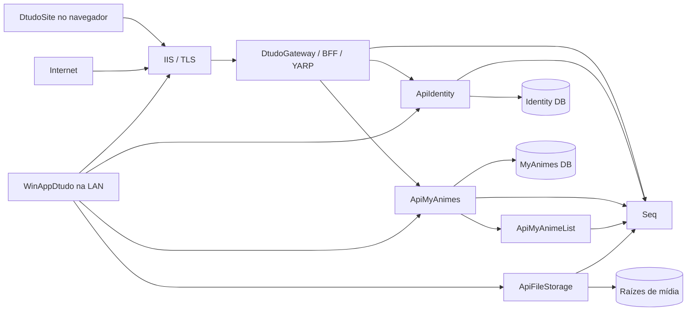

# Plano de Implementação da Segurança - Dtudo2026

## 1. Como usar este arquivo

Este arquivo foi organizado para ser executado em **30 chats independentes e sequenciais**. Cada etapa trata uma única fronteira técnica e termina com validação e checkpoint.

### Regra principal

**Não peça à IA para implementar este arquivo inteiro, um bloco inteiro ou várias etapas de uma vez.**

Para cada etapa:

1. Abra um **novo chat** no VS Code, no mesmo workspace.
2. Localize a próxima etapa com estado `Pendente` em `docs/security/STATUS_SEGURANCA.md`.
3. Copie somente o bloco **Prompt para iniciar o chat** daquela etapa.
4. A IA lerá neste arquivo somente as regras globais, decisões, etapa solicitada, bloqueios e status.
5. Deixe a IA implementar, testar e atualizar o status.
6. Confira o resumo, os testes e as pendências.
7. Só abra o chat seguinte quando a etapa estiver `Concluída`.

A Etapa 01 cria `docs/security/STATUS_SEGURANCA.md`. Depois, esse arquivo será a memória curta entre chats. Não cole conversas anteriores nem o plano inteiro em cada mensagem.

### O que enviar em cada chat

Envie somente o prompt da etapa. Como este arquivo está no workspace, a IA deve abri-lo diretamente. Não anexe toda a solução e não peça uma leitura geral do repositório.

### Quando continuar no mesmo chat

Continue no mesmo chat somente para:

- corrigir falha causada pela etapa;
- repetir seu teste focado;
- responder pergunta bloqueante da etapa;
- concluir seu checkpoint.

Abra outro chat para iniciar a próxima etapa, fazer um gate independente ou tratar problema antigo não relacionado.

### Contexto operacional vigente

- A solução está em desenvolvimento ativo e não será publicada nesta fase. Development local é o único ambiente em execução.
- A primeira publicação futura será uma versão mínima do `DtudoSite`, inicialmente voltada à consulta do catálogo pela `ApiMyAnimes`. Ela não autoriza colocar credenciais de serviço, tokens ou connection strings no React nem expor APIs, SQL ou Seq diretamente.
- O trabalho atual deve priorizar bases executáveis localmente e sem custo recorrente: identidade, classificação etária, autenticação, autorização, proteção de dados sensíveis, logs centralizados e monitoramento de segurança.
- Homologação e Production continuam com configurações, dados, chaves, certificados e contas separados, mas não devem ser provisionados, publicados ou cobrados antes de existir uma decisão de hospedagem e uma data de promoção.
- As referências a Windows Server, IIS, SQL Server Express, BitLocker e contas Windows neste plano descrevem o perfil de uma futura hospedagem Windows autogerenciada. Caso a hospedagem escolhida use outra plataforma, a Etapa 27 deve substituir esses mecanismos por controles equivalentes antes de qualquer publicação, mantendo os mesmos limites de rede, identidade, segredo, log, backup e TLS.

### Estados permitidos

- `Pendente`: ainda não iniciada.
- `Em andamento`: trabalho em curso no chat atual.
- `Bloqueada`: depende de decisão, infraestrutura ou ação manual.
- `Concluída`: implementação e critérios comprovados.
- `Reprovada no gate`: revisão encontrou problema que impede avanço.

### Contrato de encerramento de cada chat

Antes de terminar, a IA deve informar e registrar no status:

- etapa e estado final;
- arquivos criados ou alterados;
- testes/comandos e resultados;
- decisões e riscos residuais;
- rollback;
- bloqueios ou ações manuais;
- próxima etapa permitida.

A IA não deve iniciar a etapa seguinte no mesmo chat.

## 2. Escopo e decisões que não devem ser rediscutidos

### 2.1 Componentes

- `LibDtudo.Shared`: contratos, DTOs e utilitários compartilhados.
- `ApiMyAnimes`: proprietária do banco local de coleções e animes.
- `ApiMyAnimeList`: integração exclusiva com a API externa oficial MyAnimeList.
- `WinAppDtudo`: cliente administrativo; ao final não acessará SQL nem raízes protegidas diretamente.
- `DtudoSite`: frontend React público; usará somente o gateway/BFF.
- `ApiIdentity`: novo serviço ASP.NET Core Identity + OpenIddict, com banco próprio.
- `DtudoGateway`: novo gateway/BFF ASP.NET Core + YARP, única entrada pública.
- `ApiFileStorage`: novo serviço interno para operações autorizadas em arquivos.
- Seq: logs técnicos estruturados recebidos via Serilog.
- `ApiNode`: legado fora do escopo, salvo dependência de migração comprovada.

### 2.2 Identidade e usuários

- Não haverá cadastro público. As contas serão pré-criadas por procedimento administrativo local, com trilha de auditoria; convites não fazem parte do primeiro lançamento.
- Haverá `Superadministrador` e `Usuário do Site`. Novos papéis exigem decisão documentada e política explícita.
- Gestão de usuários, papéis, provisionamento de contas, dispositivos e sessões ocorrerá no WinApp.
- Primeiro superadministrador: bootstrap local de uso único.
- Usuários do JSON atual serão descartados e recriados.
- O provisionamento cria ou entrega a credencial inicial por canal administrativo seguro; senha temporária, token de ativação ou outro segredo nunca fica no repositório, log ou frontend.
- Administradores: passkey preferencial e TOTP alternativo.
- Recuperação administrativa: presencial/local.
- Usuários: maiores de 18 anos. Não armazenar nascimento completo; guardar confirmação e versão dos termos.
- O primeiro lançamento não terá login, recursos pessoais ou conteúdo adulto. Em versão autenticada posterior, catálogo continua público; favoritos, preferências, listas pessoais e conteúdo 18+ ficam privados por padrão e exigem sessão válida.
- Exportação e solicitação de exclusão dos próprios dados conforme LGPD.

### 2.3 Autenticação e autorização

- WinApp: Authorization Code + PKCE pelo navegador do sistema e redirect de loopback.
- Site: BFF com cookie `HttpOnly`/`Secure`; tokens nunca expostos ao React.
- Serviços: Client Credentials + mTLS, identidade e escopos próprios.
- Sessão confiável do WinApp: máximo 30 dias, refresh rotation, reuse detection, revogação e DPAPI.
- Revogação de usuário/dispositivo interrompe imediatamente operações privilegiadas.
- Ações críticas exigem step-up MFA.
- Autorização por políticas nomeadas, permissões e propriedade de recurso, com negação por padrão.
- Swagger não será interface administrativa e ficará desabilitado ou restrito em produção.

### 2.4 Infraestrutura, dados e operação

- Hoje a solução permanece local e em desenvolvimento. Nenhum serviço será publicado durante as etapas de fundação.
- Na primeira publicação futura, somente a entrada pública equivalente ao gateway/BFF poderá alcançar os serviços necessários. O `DtudoSite` não pode chamar APIs internas, SQL ou Seq diretamente.
- APIs internas, SQL Server e Seq não serão expostos à internet.
- Servidor de aplicações e SQL ficarão inicialmente no mesmo Windows Server.
- Desenvolvimento, homologação e produção terão bancos, portas, contas, chaves e certificados distintos.
- Produção: SQL Server Express + Windows Authentication. Developer somente em desenvolvimento/homologação.
- BitLocker, contas de serviço separadas, ACLs mínimas, Certificate Store e DPAPI.
- Chaves OpenIddict e Data Protection protegidas fora do diretório da aplicação.
- Backups diários: retenção de 30 dias em disco físico separado no mesmo host.
- RPO: 24 horas. RTO: 8 horas. Restauração isolada: semestral.
- Logs técnicos: Serilog + Seq. Auditoria separada: retenção de 12 meses.
- Alertas iniciais: painel e notificações Windows no WinApp.
- Repositório privado GitHub; GitHub Actions; runner de produção autohospedado e restrito.
- WinApp: MSIX assinado por certificado interno confiável nas máquinas autorizadas.

### 2.6 Prioridades da fundação para desenvolvimento

As etapas de fundação devem produzir controles que funcionem localmente, sem depender de hospedagem paga ou de servidor provisionado. A ordem de prioridade é:

1. Identidade local com contas pré-criadas, papéis, permissões, sessões revogáveis e administração pelo WinApp.
2. Classificação etária por declaração explícita de maioridade. Armazenar somente a confirmação, versão da política e data UTC; não armazenar data de nascimento completa, documento ou imagem de documento.
3. Autenticação e autorização no servidor, com negação por padrão, inclusive enquanto os clientes permanecem locais.
4. Proteção de dados sensíveis: hash nativo do ASP.NET Core Identity para senhas, Data Protection/DPAPI ou armazenamento protegido pela plataforma para chaves e tokens, e criptografia de campos somente quando a classificação de dados justificar. Não criar algoritmos próprios nem criptografar indiscriminadamente o catálogo público.
5. Logs técnicos centralizados no Seq local, auditoria separada e sinais de saúde/segurança que possam ser observados sem custo. A integração com serviço externo de monitoramento fica para a decisão de hospedagem.

Uma conta previamente criada para a primeira publicação não é uma credencial compartilhada do frontend. O React nunca recebe senha de serviço, token de longa duração ou segredo; quando houver dados privados ou conteúdo condicionado à maioridade, o acesso deve ocorrer por sessão BFF autenticada.

### 2.7 Primeiro lançamento público do catálogo

- O primeiro lançamento público é somente o catálogo de leitura do `DtudoSite`; não tem tela de login, registro, preferências, favoritos, listas pessoais ou conteúdo 18+.
- O frontend publicado é um cliente estático sem segredo. Ele consulta exclusivamente rotas públicas de leitura, expostas pelo gateway/BFF ou por uma borda pública equivalente, e nunca usa conta, senha, token de serviço ou connection string pré-criada.
- APIs internas, SQL Server, Seq, health detalhado, Swagger e rotas de escrita continuam privados. O processo servidor, quando necessário para atender o catálogo, usa sua própria identidade com privilégio mínimo.
- A publicação inicial ocorrerá em servidor Windows próprio, quando houver decisão de data e domínio. Até lá, Development local é a referência e a baseline da Etapa 07 não deve criar infraestrutura de servidor.
- A ativação posterior de login, dados pessoais ou conteúdo 18+ é uma alteração de escopo: requer as etapas de identidade/BFF aplicáveis, testes de sessão e autorização, e uma revisão do gate de publicação.

### 2.5 Arquivos

- Clientes enviam IDs e comandos, nunca caminhos absolutos ou UNC livres.
- Servidor resolve caminhos somente dentro de raízes permitidas.
- Path traversal, symlinks, junctions, hard links e reparse points serão rejeitados.
- Extensão, MIME, magic bytes, tamanho e espaço disponível serão validados.
- Arquivos passarão por quarentena e Microsoft Defender/AMSI antes da promoção.
- Exclusões usarão lixeira/quarentena por sete dias.
- Não haverá upload público na primeira versão.

## 3. Arquitetura-alvo



Limites obrigatórios:

- IIS/gateway é a única entrada pública.
- SQL aceita somente os serviços proprietários de cada banco.
- `ApiMyAnimeList` é a única integração com a API externa oficial.
- React nunca recebe access token ou refresh token.
- WinApp não mantém credencial SQL nem permissão direta nas raízes protegidas.
- `ApiFileStorage` nunca aceita caminho arbitrário do cliente.

## 4. Regras obrigatórias para todas as etapas

1. Trabalhar somente na etapa solicitada.
2. Não ler a solução inteira; começar pelos arquivos indicados e usar buscas direcionadas.
3. Ignorar `ApiNode` salvo dependência comprovada.
4. Preservar comportamento funcional fora do escopo.
5. Nunca revelar ou registrar senhas, tokens, cookies, connection strings ou chaves.
6. Não pedir segredos por chat; orientar entrada direta no terminal/ferramenta segura.
7. Usar bibliotecas/protocolos consolidados; não criar criptografia, hash de senha ou token próprios.
8. Fazer a menor alteração testável possível.
9. Após a primeira alteração, executar imediatamente o teste focado.
10. Preservar/corrigir XML/Swagger comments dos controllers.
11. Fazer backup e definir rollback antes de migração destrutiva.
12. Não corrigir falhas antigas não relacionadas; registrá-las separadamente.
13. Não iniciar a próxima etapa.
14. Atualizar `docs/security/STATUS_SEGURANCA.md` somente com evidências reais.
15. Não concluir etapa se teste obrigatório não puder ser executado.

## 5. Arquivo de continuidade entre chats

A Etapa 01 deve criar `docs/security/STATUS_SEGURANCA.md` com esta estrutura:

```markdown
# Status da Implementação de Segurança

## Estado geral
- Etapa atual: 01
- Última etapa concluída: nenhuma
- Próxima etapa permitida: 01
- Bloqueios globais: nenhum

## Etapas
| Etapa | Estado | Evidência principal | Data UTC |
|---|---|---|---|
| 01 | Pendente | - | - |

## Última execução
- Objetivo:
- Arquivos alterados:
- Testes executados:
- Resultado:
- Decisões:
- Riscos residuais:
- Rollback:
- Ações manuais:

## Decisões posteriores ao plano
- Nenhuma.
```

Cada chat deve preservar o histórico resumido das etapas e substituir somente `Última execução`. Não guardar segredos, saídas grandes ou explicações extensas.

## 6. Mapa das etapas

| Bloco | Etapas | Resultado |
| --- | ---: | --- |
| A. Fundação | 01-08 | Inventário, configuração, CI, logs, auditoria, backup e host preparados |
| B. Identidade | 09-20 | Identity/OpenIddict, MFA, sessões, APIs, BFF, site e WinApp integrados |
| C. Arquivos e acesso local | 21-25 | Serviço de arquivos e remoção do acesso direto do WinApp |
| D. Produção | 26-29 | Resiliência, IIS, alertas, pacote e implantação preparados |
| E. Gate final | 30 | Exercícios, revisão independente e decisão de publicação |

Os gates são as Etapas 08, 20 e 30. Execute-os em chats novos, preferencialmente com um modelo forte e sem pedir novas funcionalidades.

## 7. Etapas executáveis

### Etapa 01 - Inventário e modelo de ameaças

**Depende de:** nenhuma.

**Escopo:** criar status; inventariar ativos, dados, portas, identidades, chamadas e raízes; produzir STRIDE e matriz endpoint x ator x permissão. Sem alterar a aplicação.

**Pronto quando:** documentos consistentes existem e registram lacunas sem expor segredos.

**Prompt para iniciar o chat:**

```prompt
Execute exclusivamente a Etapa 01 de PLANO_SEGURANCA_DTUDO2026.md.
Leia as seções 1 a 5, a Etapa 01 e as seções 8 e 9. Não leia a solução inteira.
Crie docs/security/STATUS_SEGURANCA.md, INVENTARIO_SEGURANCA.md, MODELO_AMEACAS.md e MATRIZ_ACESSO.md. Use buscas e leituras direcionadas nos pontos de entrada, configurações, controllers e serviços proprietários. Não altere comportamento nem implemente controles.
Valide consistência, atualize o status e encerre sem iniciar a Etapa 02.
```

### Etapa 02 - Segredos e configuração segura

**Depende de:** Etapa 01.

**Escopo:** detectar segredos no conteúdo/histórico Git, preparar rotação, retirar valores versionados, usar fontes seguras e `ValidateOnStart`.

**Pronto quando:** nenhum segredo válido está versionado e serviços falham fechados sem configuração obrigatória.

**Prompt para iniciar o chat:**

```prompt
Execute exclusivamente a Etapa 02 de PLANO_SEGURANCA_DTUDO2026.md.
Leia regras globais, Etapa 02, bloqueios e docs/security/STATUS_SEGURANCA.md. Confirme a Etapa 01.
Varra segredos no conteúdo e histórico Git sem revelar valores. Remova valores versionados, configure fontes seguras por ambiente e Options tipadas com ValidateOnStart. Gere lista de rotação por tipo de segredo; não faça outras modernizações.
Teste inicialização válida/falha fechada, atualize o status e não inicie a Etapa 03.
```

### Etapa 03 - Pipeline e cadeia de dependências

**Depende de:** Etapa 02.

**Escopo:** GitHub Actions para build/testes, análise estática, vulnerabilidades, secret scanning, actions por SHA e isolamento de código não confiável.

**Pronto quando:** pipeline bloqueia falha, segredo sintético e vulnerabilidade controlada; PR não confiável não alcança produção.

**Prompt para iniciar o chat:**

```prompt
Execute exclusivamente a Etapa 03 de PLANO_SEGURANCA_DTUDO2026.md.
Leia regras globais, Etapa 03 e o status. Inspecione somente workflows, projetos e scripts de build.
Implemente GitHub Actions com build Release, testes, análise estática, auditoria de dependências e secret scanning. Fixe actions por SHA e impeça PR não confiável de usar runner/segredos de produção.
Valide o possível localmente, documente verificações do GitHub, atualize o status e não inicie a Etapa 04.
```

### Etapa 04 - Logging estruturado e correlação

**Depende de:** Etapa 02.

**Escopo:** Serilog + Seq nas APIs, trace/correlation ID e redação de dados sensíveis. Sem auditoria de negócio.

**Pronto quando:** chamada entre serviços é correlacionada e logs não contêm dados proibidos.

**Prompt para iniciar o chat:**

```prompt
Execute exclusivamente a Etapa 04 de PLANO_SEGURANCA_DTUDO2026.md.
Leia regras globais, Etapa 04 e o status. Comece pelos Program.cs e clientes HTTP; não leia controllers sem necessidade.
Implemente Serilog, Seq, trace/correlation ID e filtros/redação. Não registre corpos completos por padrão.
Teste correlação e ausência de dados proibidos, valide APIs tocadas, atualize o status e não inicie a Etapa 05.
```

### Etapa 05 - Auditoria de segurança

**Depende de:** Etapas 02 e 04.

**Escopo:** auditoria append-only separada dos logs, retenção de 12 meses e contrato para eventos futuros.

**Pronto quando:** evento possui campos obrigatórios e identidade normal não altera/exclui registros.

**Prompt para iniciar o chat:**

```prompt
Execute exclusivamente a Etapa 05 de PLANO_SEGURANCA_DTUDO2026.md.
Leia regras globais, Etapa 05 e o status. Inspecione somente DbContext/migrations necessários.
Modele trilha de auditoria separada do Seq, append-only para a aplicação, com ator, ação, alvo, resultado, UTC, dispositivo, correlação, motivo e retenção de 12 meses. Crie API interna de gravação; não instrumente eventos de identidade inexistentes.
Teste persistência e negação de alteração/exclusão, atualize o status e não inicie a Etapa 06.
```

### Etapa 06 - Backup e restauração

**Depende de:** Etapa 01.

**Escopo:** backup diário de bancos, arquivos, configuração e recuperação; retenção de 30 dias; restauração isolada.

**Pronto quando:** backup/restauração foram executados e atendem RPO 24h/RTO 8h.

**Prompt para iniciar o chat:**

```prompt
Execute exclusivamente a Etapa 06 de PLANO_SEGURANCA_DTUDO2026.md.
Leia regras globais, decisões de backup, Etapa 06 e o status. Não execute operação destrutiva no banco ativo.
Crie automação idempotente de backup e retenção de 30 dias para bancos, arquivos, configurações e material de recuperação. Execute restauração isolada, verifique integridade e meça tempos.
Registre evidências sem segredos e o risco do mesmo host; atualize o status e não inicie a Etapa 07.
```

### Etapa 07 - Ambientes, contas e hardening local

**Depende de:** Etapas 01, 02 e 06.

**Escopo:** separar Development de perfis futuros, aplicar ACLs e isolamento local, e manter uma baseline idempotente e sem segredos para a futura hospedagem Windows. Sem publicar ou provisionar servidor.

**Pronto quando:** o perfil Development possui diretórios e bancos isolados, as verificações negativas provam isolamento de bancos, diretórios e portas, e a baseline futura não possui segredos. Windows Authentication, ACLs de serviço, firewall, BitLocker, SQL Express e IIS/TLS devem permanecer declarados e ter rollback para uso somente quando existir decisão de promoção.

**Prompt para iniciar o chat:**

```prompt
Execute exclusivamente a Etapa 07 de PLANO_SEGURANCA_DTUDO2026.md.
Leia regras globais, decisões de infraestrutura, Etapa 07 e o status. Não publique serviços.
Defina/configure o isolamento local de Development e mantenha declarados os controles de promoção: contas Windows/SQL, Windows Authentication, ACLs, firewall, BitLocker, SQL Express e baseline IIS/TLS. Produza scripts idempotentes e rollback sem segredos; não provisione servidor nem exija hospedagem paga.
Execute verificações negativas, registre ações administrativas, atualize o status e não inicie a Etapa 08.
```

### Etapa 08 - Gate da fundação

**Depende de:** Etapas 01 a 07.

**Escopo:** revisão independente, sem funcionalidades novas.

**Pronto quando:** evidências são reproduzíveis ou o gate fica reprovado com correções vinculadas.

**Prompt para iniciar o chat:**

```prompt
Revise exclusivamente o Gate da Etapa 08 de PLANO_SEGURANCA_DTUDO2026.md.
Leia regras, Etapas 01-08, bloqueios e o status. Não implemente a Etapa 09 nem novas funcionalidades.
Reexecute amostras críticas: configuração, pipeline, correlação/redação, auditoria, backup/restauração e permissões negativas. Compare com os critérios.
Marque Concluído ou Reprovado, liste correções por etapa, atualize o status e encerre.
```

### Etapa 09 - Fundação da ApiIdentity

**Depende de:** Gate 08 aprovado.

**Escopo:** `ApiIdentity`, banco/DbContext próprios, Identity, OpenIddict, migrations e health checks.

**Pronto quando:** serviço/banco isolados iniciam; migration/rollback funcionam; não existe cadastro público.

**Prompt para iniciar o chat:**

```prompt
Execute exclusivamente a Etapa 09 de PLANO_SEGURANCA_DTUDO2026.md.
Confirme Gate 08 no status. Leia regras, decisões de identidade e Etapa 09.
Crie ApiIdentity com ASP.NET Core Identity, OpenIddict e banco/DbContext/conta separados. Configure migrations, chaves somente de desenvolvimento, configuração validada e health checks. Não implemente provisionamento de contas, MFA, BFF ou clientes.
Teste inicialização, isolamento, migration e rollback; atualize o status e não inicie a Etapa 10.
```

### Etapa 10 - Usuários, papéis e permissões

**Depende de:** Etapa 09.

**Escopo:** modelos/contratos de usuário, maioridade, termos, papéis, permissões e políticas. Sem UI ou provisionamento de contas.

**Pronto quando:** constraints/índices existem, permissões são centralizadas e nascimento completo não é armazenado.

**Prompt para iniciar o chat:**

```prompt
Execute exclusivamente a Etapa 10 de PLANO_SEGURANCA_DTUDO2026.md.
Leia regras, decisões de usuários/autorização, Etapa 10 e o status. Comece no DbContext da ApiIdentity.
Modele confirmação de maioridade, aceite versionado dos termos, papéis e permissões. Crie catálogo central, políticas, constraints, índices, migrations e contratos. Não implemente provisionamento de contas, MFA ou UI.
Teste invariantes, duplicidades e rollback; atualize o status e não inicie a Etapa 11.
```

### Etapa 11 - Bootstrap e provisionamento de contas

**Depende de:** Etapas 09 e 10.

**Escopo:** bootstrap local único e provisionamento manual auditável de contas pré-criadas. Sem convite, registro público ou entrega de segredo pelo frontend.

**Pronto quando:** bootstrap e credencial inicial não são reutilizáveis; segredo bruto não fica no banco/log; tentativas inválidas não enumeram contas.

**Prompt para iniciar o chat:**

```prompt
Execute exclusivamente a Etapa 11 de PLANO_SEGURANCA_DTUDO2026.md.
Leia regras, decisões de bootstrap/provisionamento, Etapa 11 e o status.
Implemente bootstrap local de uso único e provisionamento administrativo de contas com segredo inicial de alta entropia, hash, expiração, uso único, revogação e rate limiting. Não envie e-mail, não crie convite e não crie cadastro público.
Teste replay, expiração, revogação, concorrência, enumeração e bootstrap; atualize o status e não inicie a Etapa 12.
```

### Etapa 12 - Passkeys, TOTP e step-up MFA

**Depende de:** Etapa 11.

**Escopo:** passkey, TOTP, proteção de segredos e reautenticação crítica.

**Pronto quando:** cadastro/autenticação/revogação funcionam; replay falha; ação crítica exige autenticação recente.

**Prompt para iniciar o chat:**

```prompt
Execute exclusivamente a Etapa 12 de PLANO_SEGURANCA_DTUDO2026.md.
Leia regras, decisões MFA, Etapa 12 e o status. Use APIs/bibliotecas oficiais; não implemente WebAuthn/TOTP/criptografia manualmente.
Implemente passkeys, TOTP alternativo, proteção, recuperação local e step-up para usuários/papéis, sessões/dispositivos, exclusões em massa e restauração. Não crie UI completa do WinApp.
Teste desafio, replay, expiração, revogação e clock skew; atualize o status e não inicie a Etapa 13.
```

### Etapa 13 - Dispositivos, sessões e revogação

**Depende de:** Etapa 12.

**Escopo:** dispositivos, 30 dias, tokens curtos/de referência, refresh rotation, reuse detection e revogação imediata.

**Pronto quando:** reutilização revoga família e bloqueio interrompe operação privilegiada ativa.

**Prompt para iniciar o chat:**

```prompt
Execute exclusivamente a Etapa 13 de PLANO_SEGURANCA_DTUDO2026.md.
Leia regras, decisões de sessão/revogação, Etapa 13 e o status.
Implemente dispositivo confiável, sessão de 30 dias, access token curto, refresh rotation/reuse detection, referência/introspecção ou equivalente e revogação privilegiada imediata. Audite eventos.
Teste concorrência, replay, expiração, bloqueio e revogação ativa; atualize o status e não inicie a Etapa 14.
```

### Etapa 14 - Proteção das APIs de anime

**Depende de:** Etapas 10 e 13.

**Escopo:** autenticação/autorização, issuer/audience, políticas e classificação de endpoints nas duas APIs.

**Pronto quando:** mutações negam anônimo/permissão incorreta; públicos estão enumerados; Swagger restrito.

**Prompt para iniciar o chat:**

```prompt
Execute exclusivamente a Etapa 14 de PLANO_SEGURANCA_DTUDO2026.md.
Leia regras, MATRIZ_ACESSO.md, decisões de autorização, Etapa 14 e o status. Leia apenas Program.cs, controllers e testes atingidos.
Proteja ApiMyAnimes e ApiMyAnimeList com issuer, audience, escopos, permissões e políticas. Negue por padrão, declare públicos e restrinja Swagger. Preserve/corrija XML.
Execute testes positivos e principalmente negativos; atualize matriz/status e não inicie a Etapa 15.
```

### Etapa 15 - Client Credentials e mTLS

**Depende de:** Etapas 13 e 14.

**Escopo:** identidade/certificado/escopos por serviço e rotação.

**Pronto quando:** cada serviço acessa só o necessário e credenciais cruzadas são recusadas.

**Prompt para iniciar o chat:**

```prompt
Execute exclusivamente a Etapa 15 de PLANO_SEGURANCA_DTUDO2026.md.
Leia regras, decisões mTLS/certificados, Etapa 15 e o status. Inspecione apenas HTTP interno.
Implemente Client Credentials + mTLS com client ID, certificado e escopos exclusivos, Certificate Store, ACLs e rotação sobreposta. Não use chave compartilhada.
Teste audience, escopo, identidade e certificado incorretos e rotação; atualize o status e não inicie a Etapa 16.
```

### Etapa 16 - DtudoGateway e BFF

**Depende de:** Etapas 13 a 15.

**Escopo:** YARP/BFF, OIDC Code + PKCE, cookie seguro, antiforgery, redirects e tokens no servidor.

**Pronto quando:** browser não recebe tokens; CSRF/open redirect/rota indevida são recusados.

**Prompt para iniciar o chat:**

```prompt
Execute exclusivamente a Etapa 16 de PLANO_SEGURANCA_DTUDO2026.md.
Leia regras, decisões BFF, Etapa 16 e o status.
Crie DtudoGateway com YARP, OIDC Code + PKCE, cookie HttpOnly/Secure/SameSite adequado, antiforgery, allowlist de redirects e tokens somente no backend. Exponha só rotas necessárias.
Teste CSRF, redirect, cookie, logout, rota negada e ausência de tokens; atualize o status e não inicie a Etapa 17.
```

### Etapa 17 - DtudoSite com BFF

**Depende de:** Etapa 16.

**Escopo:** remover tokens do React, usar sessão BFF e preservar catálogo público.

**Pronto quando:** React não lê/persiste tokens; login/logout/expiração/revogação funcionam.

**Prompt para iniciar o chat:**

```prompt
Execute exclusivamente a Etapa 17 de PLANO_SEGURANCA_DTUDO2026.md.
Leia regras, decisões do site, Etapa 17 e o status. Comece no router, contexto auth e serviços HTTP.
Migre frontend para sessão/cookie BFF, removendo token de JavaScript/localStorage/sessionStorage. Preserve catálogo público e trate login, logout, expiração, revogação e erro.
Teste frontend/integração e ausência de tokens; atualize o status e não inicie a Etapa 18.
```

### Etapa 18 - Recursos pessoais e LGPD

**Depende de:** Etapas 14 e 17.

**Escopo:** favoritos/listas privados, exportação/exclusão, maioridade e termos.

**Pronto quando:** usuário A não acessa B; exportação é completa; exclusão respeita retenção/auditoria.

**Prompt para iniciar o chat:**

```prompt
Execute exclusivamente a Etapa 18 de PLANO_SEGURANCA_DTUDO2026.md.
Leia regras, decisões LGPD/propriedade, Etapa 18, matriz e status.
Implemente owner authorization para favoritos, preferências e listas. Implemente maioridade sem nascimento completo, termos versionados, exportação e solicitação de exclusão com retenção/auditoria.
Teste isolamento, exportação, exclusão e minimização; atualize documentos/status e não inicie a Etapa 19.
```

### Etapa 19 - Autenticação e administração no WinApp

**Depende de:** Etapas 11 a 16.

**Escopo:** navegador + PKCE/loopback, DPAPI, logout/revogação e gestão de identidade no Dark Mode.

**Pronto quando:** WinApp não coleta senha nem guarda token claro; gestão respeita permissões/step-up.

**Prompt para iniciar o chat:**

```prompt
Execute exclusivamente a Etapa 19 de PLANO_SEGURANCA_DTUDO2026.md.
Leia regras, decisões WinApp, Etapa 19 e o status. Localize somente cliente HTTP, inicialização, auth atual e padrões visuais próximos.
Implemente navegador do sistema com Code + PKCE/loopback, DPAPI, renovação, logout e revogação. No Dark Mode existente, implemente gestão de provisionamento de contas, usuários, papéis, dispositivos e sessões com step-up.
Teste ausência de senha/token claro, permissões e revogação; atualize o status e não inicie a Etapa 20.
```

### Etapa 20 - Remoção do login legado e gate de identidade

**Depende de:** Etapas 09 a 19.

**Escopo:** remover JSON/serviço/endpoints legados após migração e revisar identidade completa.

**Pronto quando:** nenhum cliente legado resta e testes negativos/rotação/revogação/rollback passam.

**Prompt para iniciar o chat:**

```prompt
Execute exclusivamente a Etapa 20 e o gate de identidade de PLANO_SEGURANCA_DTUDO2026.md.
Leia regras, Etapas 09-20, bloqueios e status. Confirme todos os clientes novos antes de remover código.
Remova LocalAuthService, AuthController provisório, JSON e configurações obsoletas. Revise provisionamento de contas, MFA, sessão, revogação, APIs, mTLS, BFF, site, LGPD e WinApp; reexecute negativos e rollback.
Marque Concluído ou Reprovado, atualize o status e não inicie a Etapa 21.
```

### Etapa 21 - Fundação da ApiFileStorage

**Depende de:** Gate 20 aprovado.

**Escopo:** serviço, raízes, IDs, resolução canônica e bloqueio de caminhos maliciosos. Sem ciclo destrutivo completo.

**Pronto quando:** absoluto, UNC, traversal, encoding, links/reparse e TOCTOU são recusados.

**Prompt para iniciar o chat:**

```prompt
Execute exclusivamente a Etapa 21 de PLANO_SEGURANCA_DTUDO2026.md.
Leia regras, decisões de arquivos, Etapa 21 e o status. Não leia todo o WinApp.
Crie ApiFileStorage autenticada com raízes permitidas, IDs lógicos, resolução canônica e proteção contra absoluto/UNC, traversal, encoding duplo, symlink, junction, hard link, reparse point e TOCTOU.
Execute testes negativos extensos e de ACL; atualize o status e não inicie a Etapa 22.
```

### Etapa 22 - Quarentena e ciclo de vida dos arquivos

**Depende de:** Etapa 21.

**Escopo:** importação local, limites, magic bytes, hash, temporário, Defender/AMSI, promoção, lixeira e reconciliação.

**Pronto quando:** inválido/malicioso não é promovido, scanner falha fechado e falha parcial é reconciliável.

**Prompt para iniciar o chat:**

```prompt
Execute exclusivamente a Etapa 22 de PLANO_SEGURANCA_DTUDO2026.md.
Leia regras, controles de arquivos, Etapa 22 e o status.
Implemente importação permitida com limites, extensão/MIME/magic bytes, hash, espaço, temporário, Defender/AMSI, promoção, idempotency key, lixeira de sete dias e reconciliação. Scanner indisponível deve falhar fechado.
Teste malware sintético seguro, falso/grande, falta de espaço, concorrência e falha parcial; atualize o status e não inicie a Etapa 23.
```

### Etapa 23 - Inventário do acesso direto do WinApp

**Depende de:** Etapas 14, 21 e 22.

**Escopo:** localizar SQL/EF/System.IO, classificar e definir endpoints substitutos; sem migração completa.

**Pronto quando:** cada acesso possui proprietário, substituto, permissão, risco, ordem e teste.

**Prompt para iniciar o chat:**

```prompt
Execute exclusivamente a Etapa 23 de PLANO_SEGURANCA_DTUDO2026.md.
Leia regras, Etapa 23 e status. No WinApp, busque somente SQL/EF, System.IO, File, Directory, caminhos e serviços relacionados.
Produza matriz de migração para ApiMyAnimes/ApiFileStorage: contratos, idempotência, permissões, consistência, ordem e testes. Implemente apenas contratos/endpoints mínimos para desbloquear migração; não remova acessos ainda.
Valide contratos, atualize o status e não inicie a Etapa 24.
```

### Etapa 24 - Remoção do SQL direto do WinApp

**Depende de:** Etapa 23.

**Escopo:** migrar banco para APIs e remover connection strings/credenciais SQL.

**Pronto quando:** não há SQL/EF no WinApp e retirar permissão SQL não quebra fluxos.

**Prompt para iniciar o chat:**

```prompt
Execute exclusivamente a Etapa 24 de PLANO_SEGURANCA_DTUDO2026.md.
Leia regras, matriz da Etapa 23 e status.
Migre operações SQL/EF do WinApp para endpoints autorizados/idempotentes da ApiMyAnimes. Preserve comportamento, feedback de importação e regras DB_Local. Remova connection strings, credenciais, DbContexts e permissões após testes.
Teste fluxos e ausência de permissão SQL; atualize o status e não inicie a Etapa 25.
```

### Etapa 25 - Remoção do acesso direto a arquivos

**Depende de:** Etapas 22 a 24.

**Escopo:** migrar arquivos para `ApiFileStorage` e retirar ACLs do WinApp.

**Pronto quando:** WinApp usa IDs/comandos e funciona sem permissão nas raízes.

**Prompt para iniciar o chat:**

```prompt
Execute exclusivamente a Etapa 25 de PLANO_SEGURANCA_DTUDO2026.md.
Leia regras, matriz da Etapa 23, decisões de arquivos e status.
Migre operações de arquivo para ApiFileStorage usando IDs/comandos. Preserve feedback em tempo real. Aplique step-up, prévia e lixeira em exclusões em massa. Remova caminhos/ACLs após equivalência.
Teste sem ACL e varra acessos residuais; atualize o status e não inicie a Etapa 26.
```

### Etapa 26 - Resiliência da ApiMyAnimeList

**Depende de:** Etapas 04, 14 e 15.

**Escopo:** timeout, retry seguro com jitter, circuit breaker, 504, correlação e SSRF/egress.

**Pronto quando:** falhas não causam retry storm e o serviço recupera após circuito.

**Prompt para iniciar o chat:**

```prompt
Execute exclusivamente a Etapa 26 de PLANO_SEGURANCA_DTUDO2026.md.
Leia regras, decisões MyAnimeList, Etapa 26 e status. Comece no MyAnimeListClient.
Implemente resiliência atual do stack para timeout, 429/5xx/504, retry com jitter só quando idempotente, circuit breaker, cancelamento, correlação e allowlist egress/SSRF. Não crie nova API externa.
Simule falhas e recuperação; atualize o status e não inicie a Etapa 27.
```

### Etapa 27 - IIS, TLS e isolamento de rede

**Depende de:** Etapas 16, 20 e 26. A Etapa 25 é obrigatória somente antes de publicar qualquer fluxo de arquivo.

**Escopo:** homologação do catálogo público via IIS/YARP, TLS, HSTS, headers, limites, rate limiting, firewall e bindings. O primeiro lançamento não inclui fluxos de arquivo, login ou conteúdo adulto.

**Pronto quando:** externamente só o gateway responde, renovação TLS é comprovada e o site publicado contém somente catálogo público sem segredo, login ou conteúdo condicionado à idade.

**Prompt para iniciar o chat:**

```prompt
Execute exclusivamente a Etapa 27 de PLANO_SEGURANCA_DTUDO2026.md.
Leia regras, arquitetura, decisões de rede, Etapa 27 e status. Trabalhe em homologação; não exponha produção.
Configure IIS/YARP, domínio/TLS automático, HSTS, headers, limites, rate limiting, health checks, firewall e bindings internos. Restrinja CORS, Swagger e Seq. Exponha apenas as rotas públicas de leitura necessárias ao catálogo.
Teste portas/rotas/TLS/headers/CORS/renovação, ausência de segredos no build estático e negação de login/escrita/conteúdo adulto; atualize o status e não inicie a Etapa 28.
```

### Etapa 28 - Painel de saúde e alertas

**Depende de:** Etapas 04 a 07 e 27.

**Escopo:** painel Dark Mode e notificações para serviços, segurança, certificados, disco, backup e quarentena.

**Pronto quando:** críticos alertam sem dados sensíveis e fonte indisponível não trava o WinApp.

**Prompt para iniciar o chat:**

```prompt
Execute exclusivamente a Etapa 28 de PLANO_SEGURANCA_DTUDO2026.md.
Leia regras, decisões de alertas, Etapa 28 e status. Reuse ThemeManager, DarkModeColors e padrões WinApp.
Implemente painel/notificações Windows para serviços, segurança, certificado, espaço, backup e quarentena, com consultas autenticadas, timeouts e estados indisponíveis.
Teste estados e DPI alto; atualize o status e não inicie a Etapa 29.
```

### Etapa 29 - MSIX, runner e implantação

**Depende de:** Etapas 03, 07, 19 e 27.

**Escopo:** MSIX assinado, hashes, atualização/rollback, runner restrito e aprovação.

**Pronto quando:** pacote adulterado falha, runner não executa PR não confiável e rollback funciona.

**Prompt para iniciar o chat:**

```prompt
Execute exclusivamente a Etapa 29 de PLANO_SEGURANCA_DTUDO2026.md.
Leia regras, decisões de entrega, Etapa 29 e status.
Configure MSIX, assinatura interna protegida, versão, hash, atualização e rollback. Endureça runner com conta restrita, execução controlada, aprovação, actions por SHA, artefatos imutáveis e isolamento de PR.
Teste pacote, atualização/rollback e permissões; atualize o status e não inicie a Etapa 30.
```

### Etapa 30 - Gate final e publicação

**Depende de:** Etapas 01 a 29 e Gates 08/20 aprovados.

**Escopo:** revisão independente, restauração, incidentes, testes de segurança e checklist. Sem funcionalidades novas.

**Pronto quando:** bloqueios foram eliminados ou publicação foi formalmente recusada.

**Prompt para iniciar o chat:**

```prompt
Execute exclusivamente o Gate Final da Etapa 30 de PLANO_SEGURANCA_DTUDO2026.md.
Leia plano, docs/security e status, priorizando evidências. Não leia código indiscriminadamente nem implemente funcionalidades.
Reexecute negativos críticos, restauração, revogação, isolamento, caminhos maliciosos, scanner indisponível, 504, portas, TLS, pacote e rollback. Exercite conta comprometida, segredo vazado, ransomware, backup inválido e LGPD.
Compare com bloqueios, marque Aprovado/Reprovado, produza checklist/riscos/decisão, atualize o status e encerre.
```

## 8. Riscos residuais aceitos

### Backup somente no mesmo host

O segundo disco ajuda contra falha de um disco e erro lógico, mas não protege contra roubo, incêndio, perda total, ransomware ou comprometimento administrativo. Prioridade futura: cópia criptografada offline, NAS protegido ou nuvem.

### Alertas somente locais

Painel e notificação Windows podem não ser vistos se servidor ou WinApp estiverem indisponíveis. Recomenda-se canal externo futuro.

### Runner no servidor

Até ser movido, usar conta dedicada, aprovação manual, actions por SHA, execução controlada e nenhum PR não confiável.

### Resposta a incidentes simplificada

Checklists não substituem runbooks completos e comunicação LGPD. Evoluir após exercícios.

### SQL Server Express

Monitorar 10 GB por banco, crescimento e backup/restauração. Usar Task Scheduler ou serviço equivalente.

### Assinatura interna do WinApp

Adequada para duas a cinco máquinas controladas; não fornece reputação pública SmartScreen.

## 9. Condições que bloqueiam avanço ou publicação

Uma etapa fica `Bloqueada` se sua dependência não estiver concluída, faltar backup/rollback para mudança destrutiva ou validação obrigatória não puder ser executada.

Não publicar se:

- segredo versionado ainda está válido;
- API interna, SQL ou Seq está exposto à internet;
- endpoint mutável não possui autorização explícita;
- token OAuth está disponível ao React;
- WinApp coleta senha, guarda token claro ou possui credencial SQL;
- WinApp acessa banco ou raízes protegidas diretamente;
- bootstrap é reutilizável ou existe cadastro público;
- revogação imediata privilegiada não foi comprovada;
- backup não teve restauração comprovada;
- chave/certificado não tem backup e rotação;
- produção usa SQL Server Developer;
- serviço de arquivos aceita caminho arbitrário/reparse ou ignora quarentena;
- scanner indisponível permite promoção;
- runner executa pull request não confiável;
- rollback de migration/release/pacote não foi testado;
- há falha crítica sem mitigação ou aceite explícito.

## 10. Gates de publicação

### 10.1 Primeiro lançamento público do catálogo

O catálogo público pode ser publicado antes dos módulos de arquivos, alertas e pacote do WinApp, desde que todos os itens abaixo tenham evidência e aprovação manual:

1. Gate 08 e Gate 20 aprovados.
2. Etapas 01 a 20, 26 e 27 concluídas, incluindo remoção do login legados do site e da API.
3. O build do `DtudoSite` não contém segredo, token, conta de serviço, connection string, rota de escrita, tela de login ou conteúdo 18+.
4. Somente as rotas públicas de leitura necessárias ao catálogo são alcançáveis pela internet; gateway/BFF, APIs internas, SQL, Seq, Swagger e health detalhado permanecem restritos.
5. TLS, headers, CORS, rate limiting, logs/redação, auditoria, backup/restauração e rollback da implantação foram comprovados na hospedagem Windows escolhida.
6. A publicação não transfere a conta pré-criada para o navegador. Se o catálogo precisar de acesso autenticado a um backend, a credencial pertence exclusivamente ao processo servidor com privilégio mínimo.

### 10.2 Solução completa

A segurança inicial da solução completa estará pronta para publicação somente quando:

1. Etapas 01 a 30 estiverem `Concluídas`.
2. Gates 08, 20 e 30 estiverem aprovados.
3. Nenhum bloqueio da Seção 9 estiver presente.
4. Homologação reproduzir produção sem reutilizar banco, chaves ou certificados.
5. Build/testes Release, migrations, backup, restauração e rollback tiverem evidência.
6. Checklist de publicação tiver aprovação manual.

Após publicar: atualização mensal, correção acelerada de vulnerabilidades críticas, revisão de permissões, rotação, alertas, restauração semestral e revisão de ameaças após mudanças relevantes.
