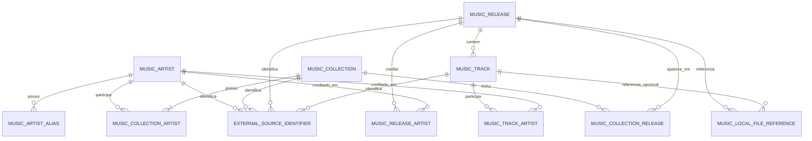

# Decisao de dominio: ApiMusicX

**Status:** proposta para a Parte 1.1
**Escopo:** modelo local da Colecao de discografias e contrato conceitual de importacao
**Fora do escopo:** migrations, controllers, cliente Discogs, integracao com WinAppDtudo e operacoes no sistema de arquivos

## 1. Decisoes principais

1. `MusicCollection` e a unidade local que representa uma Colecao de discografia. O modelo nao usa `Catalog` ou `Catalogo` como nome de entidade, regra, rota ou contrato.
2. Artistas, Colecoes, releases e faixas sao entidades separadas. Nenhuma delas e reduzida a um documento JSON unico.
3. As chaves primarias locais serao `long` geradas pelo banco. IDs de fontes externas serao armazenados como identificadores opcionais e nunca serao a chave primaria do dominio.
4. Uma Colecao pode relacionar um ou mais artistas e um release pode aparecer em mais de uma Colecao. Isso e necessario para compilacoes e para as 23 colisoes de `discogs_id` observadas no JSON legado.
5. A Discogs e apenas um provedor possivel de identificadores e dados de importacao. A ApiMusicX deve criar, consultar e persistir dados sem internet e sem a ApiDiscogs disponivel.
6. Uma referencia local guarda somente um caminho relativo normalizado. A ApiMusicX nao cria, move, renomeia, exclui ou verifica fisicamente arquivos.
7. Reimportacoes sao mesclagens nao destrutivas: dados ausentes podem ser preenchidos, mas valores locais existentes e conflitos nao sao sobrescritos silenciosamente.

## 2. Evidencias usadas

### 2.1 ApiMyAnimes

A inspecao de `ApiMyAnimes` mostrou estes padroes e limites:

- `MyAnimesContext` e um `DbContext` proprio, com `DbSet` por entidade e configuracoes Fluent para chaves, tamanhos, indices e auditoria.
- `MyAnime` possui chave local `int` identity, titulo e uma lista primitiva de IDs. `Anime` usa `MalId` externo como chave primaria e `ValueGeneratedNever()`.
- `MyAnimeController` separa DTOs de entrada e saida, valida IDs, pagina leituras e protege escrita com permissoes.
- `CatalogMigrationController` usa comandos repetiveis, normaliza titulo, remove duplicidades e mescla IDs. Esse comportamento e uma referencia de idempotencia, nao um modelo a ser copiado.
- As migrations e o snapshot mostram que listas primitivas podem ser persistidas pelo EF Core, mas o dominio musical precisa de tabelas relacionais para releases, faixas, creditos e referencias locais.
- A migration `CampoMyAnimeIdAdicionado` mostra que adicionar um vinculo depois exige uma alteracao explicita de schema; por isso os relacionamentos musicais devem ser decididos antes da Parte 1.3.

### 2.2 Contratos compartilhados

Podem ser reaproveitados, quando a camada de infraestrutura exigir:

- `LibDtudo.Shared.Logging.CorrelationContext` e `CorrelationIdDelegatingHandler` para correlacao de requisicoes.
- `LibDtudo.Shared.Dtos.Auth` para contratos genericos de identidade, permissoes e governanca.
- Convencoes de DTOs separados das entidades e listas inicializadas.

Nao devem ser reutilizados como dominio musical:

- `Anime`, `MyAnime`, `AdicionaAnimeDto`, `AtualizaAnimeDto`, `ObterAnimeDto` e os contratos de `MyAnimeList`, pois seus campos e chaves pertencem ao dominio de anime.
- `CatalogMigrationDtos`, pois a regra de associacao por `MalId` e especifica de `ApiMyAnimes`.

A decisao inicial e manter entidades e DTOs especificos da ApiMusicX no proprio projeto. Contratos podem ser promovidos para `LibDtudo.Shared` somente quando houver consumidores reais e estaveis em mais de um projeto.

## 3. Modelo proposto

### 3.1 Relacionamentos

A tabela `ExternalSourceIdentifier` tera exatamente um proprietario entre artista, Colecao, release ou faixa, com integridade referencial definida na configuracao do EF Core. Um release local pode ter mais de um identificador: por exemplo, um identificador Discogs de `release`, outro de `master` e um identificador legado da fonte de migracao.

### 3.2 Entidades e campos

#### `MusicArtist`

Representa artista solo, banda ou grupo sem exigir tabelas diferentes para cada tipo.

| Campo | Obrigatorio | Regra inicial |
|---|---:|---|
| `MusicArtistId` | sim | `long`, chave primaria local, gerada pelo banco |
| `DisplayName` | sim | nome original exibido; tamanho maximo definido no mapeamento |
| `NormalizedName` | sim | valor deterministico para busca e comparacao; preserva-se o nome original separadamente |
| `ArtistType` | sim | `Solo`, `Band`, `Group` ou `Unknown` |
| `SortName` | nao | nome opcional para ordenacao |

`DisplayName` ou `NormalizedName` nao e chave suficiente para mesclar artistas automaticamente: homonimos existem. Aliases ficam em `MusicArtistAlias` (`MusicArtistId`, `Value`, `NormalizedValue`), com unicidade por artista e valor normalizado.

#### `MusicCollection`

Representa a Colecao local de uma discografia. Nao e um espelho da resposta externa.

| Campo | Obrigatorio | Regra inicial |
|---|---:|---|
| `MusicCollectionId` | sim | `long`, chave primaria local, gerada pelo banco |
| `DisplayName` | sim | nome da Colecao; para o legado sera derivado do artista exibido |
| `NormalizedName` | sim | usado para busca, nao como identidade unica global |
| `Description` | nao | observacao local opcional |

O vinculo com artistas ocorre em `MusicCollectionArtist`, e nao em uma coluna de texto. A associacao primaria do JSON legado aponta para o artista do campo `artista`; outros artistas podem ser adicionados sem duplicar a Colecao.

#### `MusicCollectionArtist`

Tabela de associacao entre Colecao e artista.

| Campo | Obrigatorio | Regra inicial |
|---|---:|---|
| `MusicCollectionId` | sim | FK |
| `MusicArtistId` | sim | FK |
| `Role` | sim | `Primary`, `Member`, `Associated` ou `Unknown` |

A chave primaria e composta por `MusicCollectionId` e `MusicArtistId`. O primeiro artista importado do legado recebe `Primary`.

#### `MusicRelease`

Representa album, single, EP, compilacao, video ou release ainda nao classificado.

| Campo | Obrigatorio | Regra inicial |
|---|---:|---|
| `MusicReleaseId` | sim | `long`, chave primaria local, gerada pelo banco |
| `Title` | sim | titulo original; vazio nao e aceito |
| `NormalizedTitle` | sim | valor deterministico para busca e fallback de idempotencia |
| `ReleaseType` | sim | `Album`, `Single`, `EP`, `Compilation`, `Video` ou `Unknown` |
| `ReleaseYear` | nao | ano entre 1000 e 9999 quando conhecido |
| `Notes` | nao | observacao local ou informacao complementar opcional |

Um release pode estar em varias Colecoes por meio de `MusicCollectionRelease`. O modelo nao cria uma entidade separada obrigatoria para `Discogs master`; `master` e `release` sao tipos de recurso em `ExternalSourceIdentifier` e podem apontar para o mesmo release local quando a importacao confirmar essa equivalencia.

#### `MusicCollectionRelease`

Tabela de associacao entre Colecao e release.

| Campo | Obrigatorio | Regra inicial |
|---|---:|---|
| `MusicCollectionId` | sim | FK |
| `MusicReleaseId` | sim | FK |
| `SourceCategory` | nao | categoria original, como `albums` ou `singles-EP` |
| `DisplayOrder` | nao | ordem original da lista quando conhecida |

A chave primaria e composta por `MusicCollectionId` e `MusicReleaseId`. Repetir o mesmo release na mesma Colecao atualiza metadados da associacao sem criar outra linha.

#### `MusicReleaseArtist` e `MusicTrackArtist`

Tabelas de associacao para creditos de release e participacoes em faixas. Sao necessarias para compilacoes, artistas convidados e creditos obtidos de uma fonte normalizada. Cada uma usa chave composta pelos dois FKs e possui um `Role` opcional ou controlado (`Primary`, `Featured`, `Composer`, `Unknown`) conforme o contrato de importacao aprovado.

O artista do topo do JSON e apenas o artista primario da Colecao. Nao sera inferido como artista de todas as faixas.

#### `MusicTrack`

Representa uma faixa pertencente a um release.

| Campo | Obrigatorio | Regra inicial |
|---|---:|---|
| `MusicTrackId` | sim | `long`, chave primaria local, gerada pelo banco |
| `MusicReleaseId` | sim | FK |
| `PositionLabel` | sim quando a faixa vier de fonte normalizada | preserva valores como `A1`, `1` ou `1.1` |
| `Sequence` | sim quando a faixa vier de fonte normalizada | inteiro usado para ordenacao |
| `Title` | sim quando a faixa vier de fonte normalizada | titulo original |
| `NormalizedTitle` | sim quando a faixa vier de fonte normalizada | fallback de idempotencia |
| `DurationSeconds` | nao | duracao numerica quando disponivel |
| `DurationText` | nao | valor original quando nao for possivel converter |
| `Notes` | nao | observacao ou participacao textual opcional |

O JSON legado nao cria faixas: os nomes de arquivos nao sao considerados metadados confiaveis de titulo ou ordem. Faixas serao adicionadas quando uma importacao normalizada fornecer posicao e titulo.

#### `MusicLocalFileReference`

Representa uma referencia persistida a um arquivo ou imagem que ja pode existir fora da API.

| Campo | Obrigatorio | Regra inicial |
|---|---:|---|
| `MusicLocalFileReferenceId` | sim | `long`, chave primaria local |
| `MusicReleaseId` | sim | FK do release; sempre preenchido para manter o contexto |
| `MusicTrackId` | nao | FK opcional quando a referencia puder ser atribuida a uma faixa |
| `RelativePath` | sim | caminho relativo original, sem raiz de unidade ou UNC |
| `NormalizedPath` | sim | caminho canonico para comparacao e idempotencia |
| `MediaKind` | sim | `Audio`, `Image`, `Document` ou `Other` |
| `Role` | nao | `TrackAudio`, `Cover`, `Booklet`, `Artwork` ou `Unknown` |

`NormalizedPath` deve rejeitar caminho absoluto, unidade de disco, UNC, segmento `..`, string vazia e valores que escapem da raiz configurada. A validacao e textual; esta fase nao consulta o sistema de arquivos. A mesma referencia nao deve ser criada duas vezes para o mesmo proprietario. Uma tentativa de associar o mesmo caminho a outro release deve gerar conflito para decisao explicita.

#### `ExternalSourceIdentifier`

Representa um identificador de qualquer fonte sem acoplar o dominio a uma API externa.

| Campo | Obrigatorio | Regra inicial |
|---|---:|---|
| `ExternalSourceIdentifierId` | sim | `long`, chave primaria local |
| `Provider` | sim | `Discogs`, `ApiNode.MyMusicX` ou outro provedor aprovado |
| `ResourceType` | sim | `Artist`, `Collection`, `Release`, `Master`, `Track` ou tipo aprovado |
| `ExternalId` | sim | texto normalizado, preservando o valor recebido quando necessario |
| proprietario | sim | exatamente um FK para artista, Colecao, release ou faixa |

A unicidade e composta por `Provider`, `ResourceType` e `ExternalId`, usando comparacao consistente. O identificador externo nunca sera usado como chave primaria local e nenhum valor Discogs sera obrigatorio para criar um registro.

## 4. Chaves, indices e constraints

As constraints que a Parte 1.3 devera materializar sao:

- PK local em cada entidade principal: `MusicArtistId`, `MusicCollectionId`, `MusicReleaseId`, `MusicTrackId` e `MusicLocalFileReferenceId`.
- PK composta em `MusicCollectionArtist`, `MusicCollectionRelease`, `MusicReleaseArtist` e `MusicTrackArtist`.
- Unique em `ExternalSourceIdentifier(Provider, ResourceType, ExternalId)`.
- Unique em `MusicCollectionRelease(MusicCollectionId, MusicReleaseId)`.
- Unique em alias por artista e `NormalizedValue`.
- Index de busca em `MusicArtist.NormalizedName`, `MusicCollection.NormalizedName` e `MusicRelease.NormalizedTitle`, sem impor unicidade global a nomes.
- Unique de referencia local por proprietario e `NormalizedPath`.
- Para faixa sem identificador externo, unique por `MusicReleaseId`, `PositionLabel` normalizado e `NormalizedTitle`. Se a fonte fornecer apenas sequencia, usar `Sequence` e `NormalizedTitle`.
- Check de ano quando preenchido, tipos controlados e exatamente um proprietario em `ExternalSourceIdentifier`.
- FKs com comportamento de exclusao explicito. Excluir uma Colecao nao deve apagar automaticamente um release compartilhado; excluir um release deve tratar suas faixas, associacoes e referencias conforme a politica aprovada.

## 5. Regras de idempotencia e merge

1. **Colecao:** primeiro procurar o identificador da fonte `ApiNode.MyMusicX/Collection` ou outro identificador aprovado. Sem ele, usar o ID local fornecido pelo comando; nome e artista so podem gerar sugestao, nao uma mesclagem silenciosa.
2. **Artista:** procurar identificador externo; sem ele, comparar nome normalizado e aliases. Se houver mais de um candidato ou homonimo, retornar conflito para confirmacao.
3. **Release com ID externo:** localizar por `Provider + ResourceType + ExternalId`. Um mesmo release Discogs pode ser associado a varias Colecoes sem duplicacao.
4. **Release sem ID externo:** procurar dentro da Colecao alvo por tipo, titulo normalizado e ano. Se ano estiver ausente ou houver mais de um candidato, nao mesclar automaticamente. O identificador de entrada legado por ocorrencia pode manter a repeticao estavel durante a migracao.
5. **Faixa:** localizar primeiro por identificador externo; na ausencia dele, usar release + posicao/sequencia + titulo normalizado. Sem posicao, exigir confirmacao quando houver colisao.
6. **Referencia local:** normalizar o caminho e verificar duplicidade no mesmo proprietario. A insercao nunca verifica nem altera o arquivo fisico.
7. **Campos:** preencher apenas campos locais vazios ou explicitamente autorizados pela operacao. Divergencia entre valor local confirmado e valor importado deve ser informada como conflito; nao deve ser sobrescrita em silencio.
8. **Transacao futura:** uma importacao de Colecao, associacoes, releases, faixas e referencias deve ser uma unidade transacional na ApiMusicX quando a Parte 1.3/1.4 for implementada.
9. **Repeticao concorrente:** o servico deve confiar nas constraints unicas e tratar violacao de indice como reconsulta idempotente ou conflito, nunca como duplicacao aceitavel.

## 6. Mapeamento inicial do JSON legado

O arquivo `ApiNode/mymusicx/mymusicx.json` foi lido somente como fonte de formato. A medicao atual encontrou:

- 85 objetos em `mymusicx`;
- campos de colecao: `id`, `artista` e `releases`;
- 2.585 releases: 976 em `albums`, 1.106 em `singles-EP`, 405 em `compilations` e 98 em `videos`;
- 2.500 releases com `discogs_id` preenchido e 85 sem identificador Discogs;
- 2.489 com ano preenchido e 96 sem ano;
- 2.560 com pelo menos uma referencia em `arquivosLocais`;
- todos os 85 `id` e `artista` estao preenchidos;
- 23 identificadores Discogs aparecem em mais de uma ocorrencia;
- 78 combinacoes `(Colecao, categoria, titulo)` se repetem;
- nenhuma referencia local observada e absoluta;
- as referencias misturam audio, imagens e outros documentos. Isso sera classificado por extensao apenas como uma dica, sem validacao fisica.

### Mapeamento

| JSON legado | Modelo ApiMusicX | Regra |
|---|---|---|
| `mymusicx[].id` | `ExternalSourceIdentifier` da `MusicCollection` | `Provider=ApiNode.MyMusicX`, `ResourceType=Collection`, valor preservado como chave de rastreabilidade; nao e PK local |
| `mymusicx[].artista` | `MusicArtist.DisplayName` | preservar acentos e texto original; criar ou associar como `Primary` da Colecao |
| colecao inteira | `MusicCollection` | `DisplayName` derivado de `artista`; criar uma associacao primaria com `MusicArtist` |
| `releases.albums[]` | `MusicRelease` + `MusicCollectionRelease` | `ReleaseType=Album`, `SourceCategory=albums` |
| `releases.singles-EP[]` | `MusicRelease` + `MusicCollectionRelease` | `SourceCategory=singles-EP`; `ReleaseType=Unknown` ate confirmar se e Single ou EP |
| `releases.compilations[]` | `MusicRelease` + `MusicCollectionRelease` | `ReleaseType=Compilation`, `SourceCategory=compilations` |
| `releases.videos[]` | `MusicRelease` + `MusicCollectionRelease` | `ReleaseType=Video`, `SourceCategory=videos` |
| `titulo` | `MusicRelease.Title` | preservar valor original; preencher `NormalizedTitle` para busca |
| `ano` | `MusicRelease.ReleaseYear` | converter ano de quatro digitos; vazio vira nulo |
| `discogs_id` nao vazio | `ExternalSourceIdentifier` do release | `Provider=Discogs`, `ResourceType=Release`, ID como texto; nao chamar a Discogs durante a migracao desta parte |
| `discogs_id` vazio | nenhum identificador Discogs | usar a chave de ocorrencia legada para a importacao controlada, sem inventar um ID Discogs |
| `arquivosLocais[]` | `MusicLocalFileReference` | um registro por caminho; caminho relativo normalizado, release obrigatorio e faixa inicialmente nula |
| nome de arquivo de audio | nao criar `MusicTrack` | filename nao e prova suficiente de titulo, ordem ou artista |

Para releases sem `discogs_id`, a migracao deve gerar uma chave de ocorrencia deterministica no escopo da fonte, por exemplo `id|categoria|indice-da-lista`, e guarda-la como `ExternalSourceIdentifier` com `ResourceType=LegacyReleaseEntry`. Se a ordem ou o conteudo do JSON mudar, o importador deve comparar os demais campos e reportar conflito em vez de criar duplicatas silenciosas.

Quando o mesmo `discogs_id` aparecer em varias Colecoes, o resultado esperado e um `MusicRelease` local compartilhado com varias linhas em `MusicCollectionRelease`, desde que titulo, tipo e demais valores sejam compativeis. Divergencias devem ficar pendentes de confirmacao.

## 7. Independencia da Discogs e do sistema de arquivos

A proposta nao exige pacote, cliente HTTP, token, URL ou disponibilidade da Discogs para:

- criar uma Colecao ou artista local;
- salvar um release sem identificador externo;
- salvar faixas e referencias locais;
- consultar os dados ja persistidos.

A palavra `Discogs` aparece apenas como valor possivel de `Provider` e como origem opcional de dados. A futura `ApiDiscogs` sera uma fronteira separada; ela nao sera dependencia do `DbContext` ou das entidades da ApiMusicX.

As referencias locais sao dados textuais. A entidade e os services futuros nao terao responsabilidades de `File.Exists`, leitura de metadados, criacao de diretorio ou alteracao de arquivos. Essas operacoes permanecem fora das Fases 1 e 2.

## 8. Confirmacoes antes da Parte 1.2

1. Confirmar se os IDs locais `long` sao aceitos ou se a solucao exige `Guid` para contratos e rotas.
2. Confirmar a regra de uma Colecao com varios artistas e de um release compartilhado por varias Colecoes.
3. Confirmar se `singles-EP` deve permanecer `Unknown` na migracao ou se existe uma regra confiavel para separar Single e EP.
4. Confirmar o contrato de importacao e o mecanismo de `Idempotency-Key` para entradas sem identificador externo.
5. Confirmar se a chave de ocorrencia legada pode depender do indice da lista e qual comportamento sera adotado quando o JSON for reordenado.
6. Confirmar a politica de conflito entre valor local editado e valor recebido de uma fonte externa.
7. Confirmar os limites de caminho relativo, raiz logica e categorias de arquivo aceitas, mantendo a proibicao de acesso fisico nesta fase.
8. Confirmar se os contratos de leitura e importacao serao consumidos por mais de um projeto; somente depois decidir quais DTOs devem ir para `LibDtudo.Shared`.
9. Confirmar se `master` e `release` devem continuar como identificadores do mesmo `MusicRelease` ou se a futura regra de negocio exige uma entidade de agrupamento separada.
10. Confirmar a matriz de permissoes para leitura e escrita sem usar nomes de dominio de anime nos novos contratos.

## 9. Resultado da Parte 1.1

A proposta separa claramente artista, Colecao, release, faixa, creditos, identificadores externos e referencias locais. Ela preserva a chave legada para rastreabilidade, suporta reimportacao sem duplicacao previsivel, nao transforma `ApiNode` em dependencia de runtime e nao antecipa migrations, controllers, cliente Discogs ou integracao com `WinAppDtudo`.
