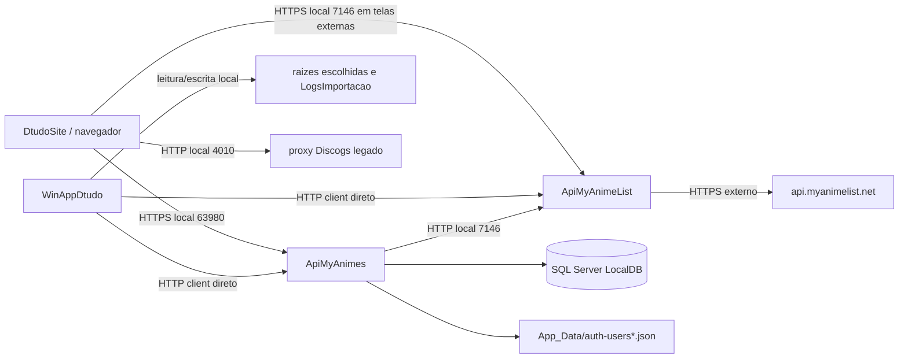

# Inventario de Seguranca

## 1. Escopo e metodo

Este inventario atende exclusivamente a Etapa 01 do plano de seguranca. A coleta foi direcionada aos pontos de entrada, configuracoes-fonte, controllers, servicos proprietarios, modelos compartilhados e clientes HTTP necessarios para reconstruir a topologia atual.

Foram usados como evidencias principais:

- `ApiMyAnimes/Program.cs`, `ApiMyAnimes/appsettings*.json`, `ApiMyAnimes/Properties/launchSettings.json`, controllers, `Data/MyAnimesContext.cs`, configuracao e servicos de autenticacao/importacao.
- `ApiMyAnimeList/Program.cs`, `ApiMyAnimeList/appsettings*.json`, `ApiMyAnimeList/Properties/launchSettings.json`, controller, configuracao e cliente HTTP.
- `WinAppDtudo/Program.cs`, `WinAppDtudo/appsettings.json`, servicos de configuracao, clientes HTTP, inicializacao local, analise/importacao e criacao de estruturas.
- `DtudoSite/src/main.jsx`, router, cliente da `ApiMyAnimes`, contexto de autenticacao, `useAuth.js`, `conectApiLocal.js` e `package.json`.
- `LibDtudo.Shared/Models/Anime.cs`, `LibDtudo.Shared/Models/MyAnime.cs` e DTOs de autenticacao.

Artefatos `bin/`, `obj/`, saidas de build, dados de teste e conteudo de arquivos de usuarios nao foram usados como fonte de inventario. Nenhum valor de segredo foi copiado para este documento.

## 2. Resumo da topologia observada

O estado atual e uma composicao local sem `DtudoGateway`, `ApiIdentity`, `ApiFileStorage` ou IIS/gateway observados nos pontos lidos. O navegador acessa diretamente a `ApiMyAnimes` para o catalogo e para o fluxo de autenticacao local. O `WinAppDtudo` tambem acessa diretamente as duas APIs, pode iniciar a `ApiMyAnimeList` e o stack do site e inicia a instancia LocalDB quando a verificacao de saude da API local falha.

Fluxo principal observado:

O diagrama registra dependencias observadas, nao uma arquitetura de producao aprovada. A arquitetura-alvo do plano ainda nao foi implementada nesta etapa.

## 3. Ativos e proprietarios

| ID | Ativo | Proprietario atual | Dados ou capacidade | Exposicao observada | Classificacao inicial |
| --- | --- | --- | --- | --- | --- |
| A-01 | `DtudoSite` React/Vite | DtudoSite | Catalogo, navegacao, estado de autenticacao no navegador e chamadas HTTP | Porta local de desenvolvimento; acessa APIs diretamente | Publico com credenciais de sessao no cliente |
| A-02 | `ApiMyAnimes` | ApiMyAnimes | CRUD de `Anime` e `MyAnime`, busca local, autenticacao JSON e health do DB_Local | HTTPS `localhost:63980`; HTTP `localhost:63981` no perfil de desenvolvimento | Servico proprietario com dados de catalogo e credenciais locais |
| A-03 | `ApiMyAnimeList` | ApiMyAnimeList | Adaptacao de busca, detalhes e relacoes do MyAnimeList | HTTPS `localhost:7146` no perfil de desenvolvimento | Servico de integracao externa |
| A-04 | `WinAppDtudo` | WinAppDtudo | Cliente administrativo, importacao, exportacao de imagens, inicializacao do stack e chamadas de escrita | Aplicacao desktop; sem listener HTTP proprio observado | Operador local e acesso a recursos do host |
| A-05 | Banco `Dtudo2026Db` em SQL Server LocalDB | ApiMyAnimes / processo com autenticacao integrada | Tabelas `MyAnimes` e `Animes`, incluindo metadados e URLs | Nao ha porta TCP de banco observada; conexao configurada para LocalDB | Dados persistentes locais |
| A-06 | Arquivo de usuarios locais | `LocalAuthService` da ApiMyAnimes | Nome, e-mail, hash de senha, datas de criacao/login | Caminho configuravel em `Auth:UsersFilePath`; padrao relativo a `App_Data` | Credencial e dado pessoal |
| A-07 | Raizes de midia escolhidas no WinApp | WinAppDtudo / usuario do Windows | Pastas de colecoes, subpastas, imagens e IDs MAL derivados dos nomes | Caminho escolhido por `FolderBrowserDialog`; leitura e escrita direta | Conteudo local e metadados de colecao |
| A-08 | Logs locais de importacao | `ImportadorAnimesMyAnimeService` | Falhas, IDs, titulos, colecao e caminho do log | `LogsImportacao` sob `AppDomain.CurrentDomain.BaseDirectory` | Log operacional potencialmente sensivel |
| A-09 | API oficial MyAnimeList | ApiMyAnimeList | Dados externos de anime, busca, detalhes, imagens e relacoes | Egress HTTPS para `api.myanimelist.net/v2/` | Dependencia externa |
| A-10 | Proxy Discogs legado | `ApiNode` somente como dependencia do fluxo MyMusicX | Consultas e dados de musica | Frontend usa padrao `localhost:4010`; iniciado pelo script `npm run proxy` | Fora do escopo de anime; dependencia legada comprovada |
| A-11 | Superficie de documentacao de desenvolvimento | ApiMyAnimes / ApiMyAnimeList | Swagger ou OpenAPI | Swagger/OpenAPI condicionado ao ambiente de desenvolvimento | Superficie tecnica |

### 3.1 Proprietarios e limites

- `ApiMyAnimes` e o proprietario atual do DB_Local, incluindo as colecoes internas `MyAnime` e os animes identificados por `MalId`.
- `ApiMyAnimeList` e a unica integracao proprietaria observada com a API oficial externa de mesmo nome.
- `WinAppDtudo` e um cliente administrativo que atualmente conhece APIs, LocalDB e caminhos de arquivos.
- `DtudoSite` e um cliente publico de navegador, sem gateway/BFF observado.
- `ApiNode` nao foi inventariada como sistema principal; o proxy Discogs foi registrado somente porque `DtudoSite` e o `package.json` demonstram dependencia direta.

## 4. Dados e armazenamentos

| Grupo | Exemplos observados | Local de armazenamento/transito | Sensibilidade e observacao |
| --- | --- | --- | --- |
| Catalogo de anime | `MalId`, titulo, titulos alternativos, episodios, score, genero, sinopse, estudio, URLs de imagem e relacoes | SQL LocalDB, respostas JSON, cache em memoria da ApiMyAnimeList e estado do cliente | Planejado como catalogo publico, mas mutacoes atuais nao estao protegidas |
| Colecoes internas | `MyAnime.Id`, titulo e lista de `AnimesMalId` | SQL LocalDB e respostas do WinApp/site | Colecao interna DB_Local; nao confundir com relacoes oficiais externas |
| Identidade local legada | Nome, e-mail, hash de senha, datas de criacao/login | Arquivo JSON sob `App_Data` | Dado pessoal e material de autenticacao; o valor do arquivo nao foi lido |
| Sessao legada | `AuthResponse.Token`, `auth_user` e `auth_token` | Resposta HTTP e `localStorage` do navegador | Credencial de sessao disponivel ao JavaScript; valor nao foi coletado |
| Configuracao | URLs de APIs, origens CORS, nome de instancia LocalDB, caminhos e flags de certificado | `appsettings*.json`, variaveis de ambiente e memoria do processo | Nao registrar segredos; `MyAnimeList:ClientId` aparece vazio no arquivo-fonte |
| Arquivos de midia | Imagens baixadas, extensoes, IDs numericos e nomes de pastas | Raiz selecionada pelo operador | Conteudo local; validacoes de tamanho, magic bytes, quarentena e reparse nao foram observadas nesta coleta |
| Logs | Mensagens de erro de importacao, IDs, titulos, colecoes e caminhos | `LogsImportacao` local | Pode conter dados operacionais e caminhos do host; nao ha redacao/correlacao observada |
| Dados externos | Respostas da MAL e URLs publicas de imagens | HTTPS entre ApiMyAnimeList e MAL; respostas para clientes | Dependencia de disponibilidade, integridade e limites da API externa |

## 5. Entradas, portas e superficies

### 5.1 Listeners e URLs observados

| Componente | URL/porta observada | Evidencia | Ambiente/qualificacao |
| --- | --- | --- | --- |
| ApiMyAnimes | `https://localhost:63980` | `ApiMyAnimes/Properties/launchSettings.json` e configuracao do WinApp/site | Perfil de desenvolvimento |
| ApiMyAnimes | `http://localhost:63981` | `ApiMyAnimes/Properties/launchSettings.json` | Perfil de desenvolvimento; redireciona para HTTPS |
| ApiMyAnimeList | `https://localhost:7146` | `ApiMyAnimeList/Properties/launchSettings.json` e configuracoes | Perfil de desenvolvimento |
| DtudoSite/Vite | `http://localhost:5173` | `DtudoSite/package.json`, `main` e origens CORS | Porta padrao observada no fluxo local |
| Origem adicional permitida | `http://localhost:5178` | `Cors:AllowedOrigins` nas duas APIs | Permitida em configuracao; listener nao confirmado |
| API local legada de musica | `http://localhost:3666` | fallback em `DtudoSite/src/api_conect/conectApiLocal.js` | Listener nao confirmado; fora do fluxo de anime |
| Proxy Discogs | `http://localhost:4010` | fallback em componentes MyMusicX e script `npm run proxy` | Listener nao confirmado; dependencia legada comprovada |
| API oficial MAL | HTTPS, porta padrao 443 | `ApiMyAnimeList:BaseUrl` e `MyAnimeListClient` | Egress externo configurado |
| SQL Server LocalDB | Instancia `MSSQLLocalDB` | connection string e `DtudoSiteStartupService` | Porta TCP nao observada; nao inventariar como exposta |

Nao ha evidencia nesta etapa de dominio publico, binding IIS, gateway, firewall, portas de producao, Seq ou SQL Server Express. Essas lacunas nao significam que nao existam; significam que nao foram demonstradas nas superficies lidas.

### 5.2 Entradas HTTP da ApiMyAnimes

Base comum: `apiLocal`.

| Controller | Rotas observadas | Operacoes | Efeito |
| --- | --- | --- | --- |
| `HealthController` | `/apiLocal/Health` | `GET` | Verifica conectividade do DB_Local e retorna estado do servico |
| `AnimeController` | `/apiLocal/Anime` | `GET`, `POST` | Lista paginada ou cria anime |
| `AnimeController` | `/apiLocal/Anime/buscar` | `GET` | Busca local por termo |
| `AnimeController` | `/apiLocal/Anime/conflito-titulo` | `POST` | Consulta conflito de titulo |
| `AnimeController` | `/apiLocal/Anime/{id}` | `GET`, `PUT`, `PATCH`, `DELETE` | Le, atualiza total/parcialmente ou remove por `MalId` |
| `MyAnimeController` | `/apiLocal/MyAnime` | `GET`, `POST` | Lista ou cria colecao |
| `MyAnimeController` | `/apiLocal/MyAnime/{id}` | `GET`, `PUT`, `PATCH`, `DELETE` | Le, atualiza total/parcialmente ou remove colecao |
| `AuthController` | `/apiLocal/Auth/register` | `POST` | Cadastra usuario no arquivo local |
| `AuthController` | `/apiLocal/Auth/login` | `POST` | Valida credencial local e retorna resposta com token |
| `AuthController` | `/apiLocal/Auth/me/{id}` | `GET` | Consulta usuario por ID sem exigir sessao observada |

Os controllers usam `UseCors`, `UseHttpsRedirection`, `UseAuthorization` e `MapControllers`. A coleta nao encontrou `AddAuthentication`, politicas, `[Authorize]` ou `[AllowAnonymous]`; portanto o middleware de autorizacao nao demonstra uma barreira efetiva.

### 5.3 Entradas HTTP da ApiMyAnimeList

| Rota | Operacao | Efeito |
| --- | --- | --- |
| `/ApiMyAnimeList/health` | `GET` | Retorna estado simples do servico |
| `/ApiMyAnimeList/search` | `GET` | Consulta a API externa por termo e pagina |
| `/ApiMyAnimeList/{id}` | `GET` | Consulta detalhes de anime na API externa |
| `/ApiMyAnimeList/{id}/relations` | `GET` | Consulta relacoes de anime na API externa |

O cliente externo usa `MyAnimeList:BaseUrl`, `ClientId`, timeout, cache e tentativas configurados. O valor de `ClientId` nao foi registrado.

### 5.4 Entradas do DtudoSite e do WinApp

- `DtudoSite` monta rotas publicas para `/animes`, `/ninoti`, `/mymusicx` e `/auth/*`, incluindo registro, login e logout no cliente.
- O cliente JavaScript da API local chama leitura de `Anime` e `MyAnime` diretamente no host configurado por `VITE_API_LOCAL_MYANIMES_BASE_URL`.
- O hook `useAuth` envia credenciais diretamente a `/apiLocal/Auth/register` e `/apiLocal/Auth/login`, persiste usuario e token em `localStorage` e remove ambos no logout.
- `WinAppDtudo` usa `ApiMyAnimesService`, `MyAnimeListApiService` e `AuthApiService` sem cabecalho de autenticacao observado.
- `WinAppDtudo` aceita uma pasta raiz via `FolderBrowserDialog`, analisa subpastas e imagens, cria pastas e salva capas localmente.
- `DtudoSiteStartupService` pode executar `sqllocaldb.exe`, `npm run serv`, `dotnet run` para a API local externa e abrir o Chrome.

## 6. Identidades e confianca

| Identidade/ator | Como aparece hoje | Escopo observado | Lacuna relevante |
| --- | --- | --- | --- |
| Navegador anonimo | Qualquer cliente que alcance as rotas | Leitura publica e, pela ausencia de autorizacao, tambem rotas mutaveis | Nao ha autenticacao de API nem separacao entre leitura e escrita |
| Usuario do site | Estado `user` e token no `localStorage` | Usado pela UI; API nao valida o token nos controllers lidos | Sessao nao e uma identidade confiavel no servidor |
| Operador do WinApp | Processo desktop e usuario Windows local | CRUD, autenticacao legada, importacao e arquivos | Nao ha identidade de cliente, escopo, step-up ou BFF observados |
| Processo ApiMyAnimes | Conta do processo e conexao integrada ao LocalDB | DB_Local, arquivo de usuarios e chamada a ApiMyAnimeList | Nao ha Client Credentials/mTLS observados |
| Processo ApiMyAnimeList | Conta do processo e `HttpClient` | Egress para API oficial MAL | Certificado, escopo e identidade interna nao observados |
| Usuario/conta do Windows | Contexto que executa WinApp, APIs e LocalDB | Pode iniciar processos e acessar arquivos conforme ACL do host | ACLs, contas de servico e separacao de ambiente nao inventariadas |
| API oficial MAL | Servico externo identificado pela URL e Client ID configurado | Retorna dados de anime e imagens | Rotacao, allowlist de egress e tratamento de SSRF nao comprovados |

## 7. Chamadas e fluxos de dados

| Fluxo | Origem | Destino | Protocolo/dado | Confiança atual |
| --- | --- | --- | --- | --- |
| F-01 | Navegador | ApiMyAnimes | HTTPS local; catalogo, colecoes e mutacoes | Fronteira direta; sem gateway e sem autorizacao efetiva observada |
| F-02 | Navegador | ApiMyAnimeList | URL de API externa local usada pelo cliente WinApp; telas do site nao demonstram cliente dedicado nas entradas lidas | Deve ser confirmado antes de tratar como caminho de producao |
| F-03 | WinApp | ApiMyAnimes | HTTPS; CRUD local e autenticacao legada | Cliente direto sem credencial de servico observada |
| F-04 | WinApp | ApiMyAnimeList | HTTPS; busca, detalhes, relacoes e inicializacao sob demanda | Cliente direto sem credencial de servico observada |
| F-05 | ApiMyAnimes | ApiMyAnimeList | HTTP client para `/ApiMyAnimeList/{malId}` | URL local configuravel; sem mTLS/escopo observado |
| F-06 | ApiMyAnimeList | API oficial MAL | HTTPS; busca, detalhes e imagens | Egress controlado apenas pela URL configurada nesta leitura |
| F-07 | ApiMyAnimes | SQL LocalDB | Entity Framework Core / SQL Server com autenticacao integrada | Banco nao deve ser entrada publica; ACL e firewall nao demonstrados |
| F-08 | ApiMyAnimes | arquivo de usuarios | Leitura/escrita JSON em caminho configuravel | Caminho pode ser absoluto; protecoes de raiz nao observadas |
| F-09 | WinApp | raizes locais | `System.IO` e `System.Drawing`; pastas e imagens | Cliente possui acesso direto a caminhos escolhidos |
| F-10 | Navegador | proxy Discogs legado | HTTP local, portas padrao `3666`/`4010` | Fora do escopo da Etapa 01 de anime, mas dependente do frontend |

## 8. Raizes, caminhos e processos locais

| Superficie | Resolucao observada | Operacoes | Risco de inventario |
| --- | --- | --- | --- |
| Arquivo de usuarios | `Auth:UsersFilePath`; caminho relativo combinado com `ContentRootPath`, ou absoluto preservado | Ler, criar diretorio, sobrescrever JSON | Raiz absoluta permitida e dados de autenticacao em arquivo local |
| Log de importacao | `AppDomain.CurrentDomain.BaseDirectory/LogsImportacao` | Criar diretorio e gravar linhas | Mensagens incluem IDs, titulos, erros e caminho retornado ao operador |
| Raiz de analise | Selecionada no WinApp; `Directory.GetDirectories` e `Directory.GetFiles` | Ler primeiro nivel de pastas, subpastas e arquivos | Nao ha confinamento a raiz autorizada do servidor; operador fornece o caminho |
| Raiz de exportacao | Selecionada no WinApp; `Path.Combine` com titulo sanitizado | Criar pastas e salvar imagens `.jpg` | Acesso direto ao sistema de arquivos e validacao limitada ao nome derivado |
| Pasta da solucao/site | Descoberta subindo diretorios ate `Dtudo2026.slnx`, ou configuracao de ambiente | Iniciar `npm`, localizar projetos e site | O processo pode executar comandos em caminho descoberto/configurado |
| Processo LocalDB | `sqllocaldb.exe start MSSQLLocalDB` por `DtudoSiteStartupService` | Iniciar instancia do banco | Acoplamento do cliente desktop ao ambiente de banco local |

## 9. Configuracoes e controles observados

| Componente | Configuracao/controle observado | Limite para seguranca |
| --- | --- | --- |
| APIs | `UseHttpsRedirection` e CORS com origens `5173` e `5178` | CORS nao substitui autenticacao; origem permitida nao impede cliente nao-browser |
| ApiMyAnimes | `AllowedHosts` em `*`, Swagger somente em Development, connection string de LocalDB | Host allowlist, Swagger de producao e fonte segura de configuracao nao comprovados |
| ApiMyAnimeList | Options para URL, Client ID, timeout e cache com `ValidateOnStart` | Nao ha allowlist de host, identidade interna ou mTLS observados |
| WinApp | Aceita certificado invalido somente no codigo compilado com `DEBUG` quando flag esta ativa | O padrao de desenvolvimento nao deve ser reutilizado em producao; validacao operacional nao feita |
| Clientes HTTP | Timeouts, cache e retries locais em alguns fluxos | Nao ha correlacao, circuit breaker ou politica uniforme observada |
| Autenticacao | Hash de senha no arquivo e token aleatorio retornado no login | Token nao e validado por middleware; registro e consulta por ID sao publicos |
| Arquivos | Extensoes de imagem permitidas no analisador e decodificacao ImageSharp | Nao ha quarentena, scanner, limite central, reparse protection ou servico de arquivos |

## 10. Lacunas e perguntas abertas

Estas lacunas sao fatos ausentes na evidencia coletada, nao afirmacoes de inexistencia:

1. Nao foi localizado `DtudoGateway`, `ApiIdentity`, `ApiFileStorage`, IIS, Seq ou configuracao de producao nas superficies permitidas desta etapa.
2. Nao foi comprovada a topologia de firewall, bindings, DNS, TLS de producao, ACLs do host ou separacao entre ambientes.
3. Nao foi feita varredura de historico Git por segredos; a Etapa 02 e responsavel por isso.
4. Nao foram confirmadas contas de servico, certificados, local de chaves, backup, restauracao ou rotacao.
5. Nao ha proprietario/owner por usuario nos modelos `Anime`/`MyAnime`; a colecao interna e global no modelo atual.
6. Nao foi encontrado mecanismo de auditoria de negocio, correlacao ou redacao de logs nas entradas lidas.
7. O uso de `VITE_API_AUTH_BASE_URL`, `VITE_API_LOCAL_MYANIMES_BASE_URL`, `VITE_API_LOCAL_BASE_URL`, `VITE_DISCOGS_TOKEN` e URLs de imagem deve ser revisado nas etapas de configuracao e BFF; seus valores nao foram coletados.
8. A exposicao real das portas locais e das rotas fora do host nao foi testada nesta etapa.

## 11. Criterio de consistencia desta etapa

O inventario e considerado consistente quando cada componente citado possui ao menos um ponto de entrada ou proprietario observado, cada porta possui fonte identificada, cada fluxo possui origem e destino, e valores desconhecidos estao marcados como lacunas. O confronto final com controllers, clientes e configuracoes e registrado no status da etapa.

## 12. Fora do escopo

Nao foram implementados controles, alterados endpoints, migrados clientes, removidos tokens, alterados arquivos de configuracao ou iniciadas etapas posteriores. `ApiNode` permanece fora da analise detalhada, com a excecao documental da dependencia Discogs demonstrada pelo frontend e pelo script de desenvolvimento.
