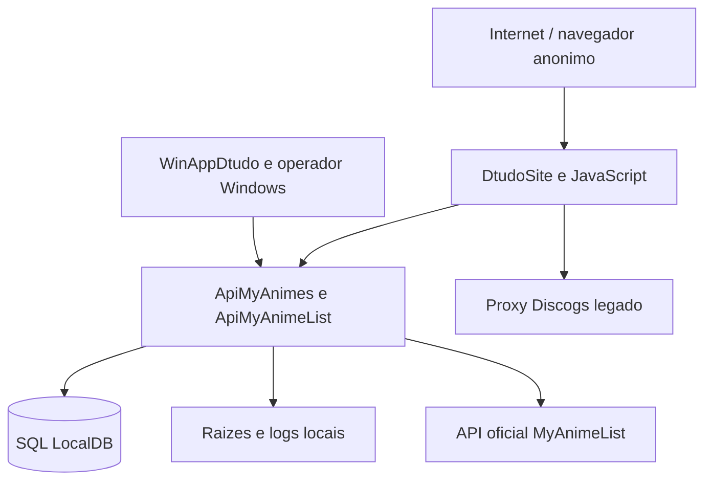

# Modelo de Ameacas

## 1. Escopo e premissas

Este modelo atende exclusivamente a Etapa 01 como baseline historico. Ele descreve ameacas verificaveis a partir das superficies lidas, usando STRIDE e riscos complementares de arquivos, egress e dependencias externas. A situacao das ameacas do login legado apos a Etapa 20 esta registrada ao final deste documento.

Premissas do modelo:

- O catalogo de animes e pretendido como publico, mas as mutacoes de `Anime` e `MyAnime` precisam de autorizacao explicita no alvo.
- A arquitetura-alvo do plano ainda nao e a topologia observada: nao ha evidencia de gateway/BFF, ApiIdentity ou ApiFileStorage nos arquivos lidos.
- O navegador, o WinApp, as APIs, o banco, o sistema de arquivos e a API oficial MAL sao fronteiras de confianca distintas.
- A ausencia de uma anotacao de autorizacao foi tratada como ausencia de evidencia, mas o efeito pratico atual e que os controllers nao demonstram uma barreira de identidade.
- Valores de credenciais, tokens, cookies, chaves e connection strings nao fazem parte deste modelo.

## 2. Fronteiras de confianca

### Limites

| Limite | De | Para | Decisao de confianca |
| --- | --- | --- | --- |
| TB-01 | navegador/publico | DtudoSite | Dados de entrada e estado do navegador sao nao confiaveis |
| TB-02 | DtudoSite | APIs | CORS e HTTPS local nao provam identidade do chamador |
| TB-03 | WinApp | APIs | Cliente administrativo deve ser autenticado no alvo; hoje nao ha credencial de servico observada |
| TB-04 | APIs | SQL/arquivo | Servicos proprietarios devem impor ACL e menor privilegio; evidencias atuais sao integracao direta |
| TB-05 | ApiMyAnimeList | API oficial MAL | Resposta externa deve ser tratada como dado nao confiavel e limitada por egress |
| TB-06 | DtudoSite | proxy Discogs | Dependencia legada separada do fluxo de anime e ainda sem gateway observado |

## 3. Atores e capacidades

| ID | Ator | Capacidade plausivel | Interesse malicioso |
| --- | --- | --- | --- |
| TA-01 | Visitante anonimo | Atingir rotas HTTP publicadas e enviar JSON/query/path | Ler catalogo, alterar dados, enumerar usuarios ou consumir recursos |
| TA-02 | Usuario do site | Usar telas de autenticacao e catalogo; estado local manipulavel | Reutilizar token, acessar dados de outro usuario ou elevar privilegio |
| TA-03 | Operador do WinApp | Executar CRUD, importar dados e escolher raizes locais | Comprometer ou abusar do host, ler arquivos fora do escopo, apagar dados |
| TA-04 | Processo comprometido | Chamar APIs internas e usar configuracoes/credenciais disponiveis | Movimento lateral, alteracao do DB_Local e exfiltracao |
| TA-05 | API oficial MAL | Retornar dados, URLs e erros externos | Indisponibilidade, conteudo inesperado, resposta malformada ou abuso de limites |
| TA-06 | Processo/usuario do host | Controlar arquivos, portas e processos conforme ACL real | Adulterar binarios, logs, configuracao, banco ou raizes |
| TA-07 | Dependencia legada | Receber chamadas do frontend no fluxo MyMusicX | Aumentar superficie publica e desviar dados fora do gateway |

## 4. STRIDE por superficie

As classificacoes `Critico`, `Alto`, `Medio` e `Baixo` sao priorizacao inicial por impacto e exposicao observados. Nao representam resultado de teste de penetracao.

| ID | Categoria | Superficie/evidencia | Ameaca | Impacto | Risco |
| --- | --- | --- | --- | --- | --- |
| T-01 | Spoofing | Controllers das duas APIs sem `AddAuthentication`, politicas ou `[Authorize]` | Um chamador anonimo se apresenta como operador ou servico porque a API nao demonstra identidade verificavel | Alteracao de catalogo, acesso a autenticacao e movimento entre servicos | Critico |
| T-02 | Tampering | `POST`, `PUT`, `PATCH` e `DELETE` de `Anime` e `MyAnime` | Qualquer cliente que alcance a rota pode criar, alterar ou remover dados | Corrupcao ou perda do DB_Local | Critico |
| T-03 | Tampering | `AuthController` e `LocalAuthService` (historico; removidos na Etapa 20) | Registro publico criava identidades fora do provisionamento administrativo; `me/{id}` aceitava identificador fornecido pelo cliente | Contas indevidas e enumeracao de dados pessoais; rotas legadas agora retornam `404` | Fechado |
| T-04 | Repudiation | `Console.WriteLine`, logs locais de importacao e ausencia de auditoria/correlacao observada | Acoes de alteracao nao possuem ator confiavel, motivo ou trilha append-only | Investigacao e responsabilizacao fracas | Alto |
| T-05 | Information disclosure | `useAuth.js` e DTO `AuthResponse` (historico; removidos) | Token de sessao ficava acessivel ao JavaScript | Sequestro de sessao legada; o BFF atual mantem tokens no servidor | Fechado |
| T-06 | Information disclosure | `AuthController.Me` (historico; removido), dados publicos e mensagens de erro | Consulta por ID sem sessao podia expor existencia, nomes ou caminhos | Exposicao de PII e topologia local; a rota legada agora retorna `404` | Fechado |
| T-07 | Information disclosure | Swagger/OpenAPI em desenvolvimento e CORS direto | Superficies tecnicas e APIs internas ficam acessiveis diretamente no ambiente local | Facilita enumeracao e abuso quando a porta e exposta | Alto |
| T-08 | Denial of service | Paginacao controlada pelo cliente, cargas de JSON, retries e importacao por pastas | Consumir CPU, memoria, banco, disco ou cota externa com chamadas repetidas | Indisponibilidade de APIs, host ou MAL | Alto |
| T-09 | Denial of service | `ImageLoaderService`, `ImageSharp` e `CriadorDeEstruturas` | Conteudo de imagem grande, malformado ou em grande volume consome recursos durante download/decodificacao | Travamento, disco cheio ou processo degradado | Alto |
| T-10 | Elevation of privilege | Ausencia de papeis/permissoes e mutacoes publicas | Usuario de leitura ou visitante executa operacao administrativa | Controle total do catalogo e identidade local | Critico |
| T-11 | Elevation of privilege | `DtudoSiteStartupService` e `WinAppDtudo` | Processo desktop inicia LocalDB, `dotnet`, `npm` e acessa caminhos descobertos/configurados | Execucao de processo e acesso lateral no host | Alto |
| T-12 | Tampering / Information disclosure | `AppConfigurationService` e flag `AllowInvalidCertificates` em `DEBUG` | URL de API ou confianca TLS alterada desvia chamadas ou aceita endpoint impostor | Interceptacao e adulteracao de dados locais | Alto |
| T-13 | SSRF/egress | URLs de imagem recebidas em `Anime` e `ImageLoaderService` aceita HTTP/HTTPS | URL controlada por dado local ou externo pode induzir requisicoes a destinos nao previstos | Acesso a rede interna ou exfiltracao | Alto |
| T-14 | Tampering | `Auth:UsersFilePath` e `LocalAuthService` (historicos; removidos) | Configuracao ou processo comprometido podia direcionar credenciais para outro local ou sobrescrever arquivo | Perda/exposicao de credenciais; nao ha arquivo de usuarios ativo | Fechado |
| T-15 | Tampering / Path traversal | Analise/exportacao em raizes escolhidas pelo WinApp | Caminhos, links, junctions ou reparse points podem atravessar a fronteira esperada | Leitura, sobrescrita ou criacao fora da raiz pretendida | Alto |
| T-16 | Information disclosure | Logs em `LogsImportacao` e mensagens apresentadas ao operador | Erros persistidos incluem IDs, titulos, colecoes e caminhos; podem ser copiados ou expostos | Vazamento de metadados e estrutura do host | Medio |
| T-17 | Spoofing / Tampering | `ApiMyAnimes` chama `ApiMyAnimeList` em URL local sem client credentials/mTLS observados | Outro processo local ou rota exposta imita o servico ou intercepta a chamada | Dados externos adulterados e movimento lateral | Alto |
| T-18 | Denial / Information disclosure | Dependencia Discogs direta no frontend | Proxy legado indisponivel ou exposto fora do limite esperado afeta o site e amplia superficie | Indisponibilidade e risco fora do dominio de anime | Medio |

## 5. Cenários de abuso prioritarios

### C-01: mutacao anonima do catalogo

1. O atacante alcanca `ApiMyAnimes` por uma origem permitida ou por cliente que ignore CORS.
2. Envia `POST`, `PUT`, `PATCH` ou `DELETE` para `Anime`/`MyAnime`.
3. Como nao ha politica de autenticacao/autorizacao demonstrada, a operacao chega ao `DbContext`.
4. O resultado e alteracao, exclusao ou associacao indevida no DB_Local.

Ativos: A-02 e A-05. Categorias: Spoofing, Tampering e Elevation. Condicao de publicacao relacionada: endpoint mutavel sem autorizacao explicita.

### C-02: sequestro da sessao legada no navegador

Este cenario e historico e foi fechado na Etapa 20: as rotas/DTOs legados foram removidos e o site usa sessao server-side no BFF.

1. Um script executado no contexto do site le `localStorage`.
2. Recupera `auth_token` retornado por `AuthResponse`.
3. Reutiliza o valor contra o fluxo de autenticacao ou o expõe em logs/telemetria.

Ativos: A-01 e A-06. Categorias: Information disclosure e Spoofing. Condicao de publicacao relacionada: token OAuth/credencial disponivel ao React.

### C-03: abuso de raiz de arquivos

1. O operador seleciona ou um processo influencia uma pasta fora da raiz pretendida.
2. O analisador percorre subpastas e arquivos e o criador grava imagens usando `System.IO`.
3. Links/reparse points, ACLs ou nomes inesperados podem direcionar a operacao para outro local.

Ativos: A-04, A-07 e A-08. Categorias: Tampering, Information disclosure e Elevation. Condicao de publicacao relacionada: WinApp com acesso direto a raizes protegidas.

### C-04: desvio de chamada externa

1. URL de API ou URL de imagem e alterada por configuracao ou dado persistido.
2. O cliente HTTP aceita a URL e executa a requisicao.
3. O destino pode ser um host interno, endpoint impostor ou recurso com resposta malformada.

Ativos: A-03, A-09 e A-07. Categorias: Spoofing, Tampering, Information disclosure e Denial.

## 6. Controles observados e limites

Os itens abaixo sao observacoes, nao controles novos:

- HTTPS redirection e CORS allowlist existem nas APIs, mas nao autenticam clientes.
- `ApiMyAnimeList` valida algumas options no inicio, enquanto `ApiMyAnimes` valida apenas a presenca do caminho de usuarios sem `ValidateOnStart` observado.
- Existem timeouts, cache e retries em clientes, mas nao ha politica uniforme de circuito, correlacao ou limite global demonstrada.
- Ha sanitizacao de nomes de pastas e validacao de extensoes no analisador, mas nao ha evidencia de confinamento canonico, reparse protection, magic bytes, quarentena ou scanner.
- O hash de senha e usado no arquivo local, mas o token retornado nao aparece ligado a middleware de autenticacao.

## 7. Lacunas que exigem confirmacao futura

1. Exposicao real das portas, firewall e bindings de producao.
2. Fonte e validade de segredos, certificados e chaves; a busca de historico Git pertence a Etapa 02.
3. Contas de servico, ACLs de banco/arquivos e isolamento por ambiente.
4. Destino, retenção e redacao de logs; auditoria separada ainda nao foi demonstrada.
5. Modelo de identidade, papeis, escopos, propriedade de recurso e step-up.
6. Backup, restauração, quarentena de arquivos e comportamento quando scanner estiver indisponivel.
7. Contrato de publicacao do proxy Discogs e demais legados do frontend.

## 8. Decisao da Etapa 01

O modelo de ameacas esta produzido e vinculado a ativos, fronteiras, endpoints e condicoes de bloqueio do plano. Nenhuma ameaca foi usada para alterar codigo nesta etapa. A remediacao deve ocorrer somente nas etapas posteriores correspondentes; este documento nao autoriza a publicacao do estado atual.

## 9. Atualizacao apos a Etapa 20

- T-03, T-05, T-06 e T-14 foram mitigadas pela remocao do `AuthController`, `LocalAuthService`, DTOs locais, configuracao `Auth:UsersFilePath` e arquivo JSON de usuarios.
- O catalogo de autorizacao, MFA, sessoes, revogacao, Client Credentials/mTLS, BFF, LGPD e WinApp foram revalidados no gate; os resultados estao em `docs/security/ETAPA_20_GATE_IDENTIDADE.md`.
- Permanecem riscos de ambiente e publicacao: certificados reais, contas de servico, issuer/discovery, firewall, worker de retencao LGPD e homologacao. A Etapa 21 nao foi iniciada.
